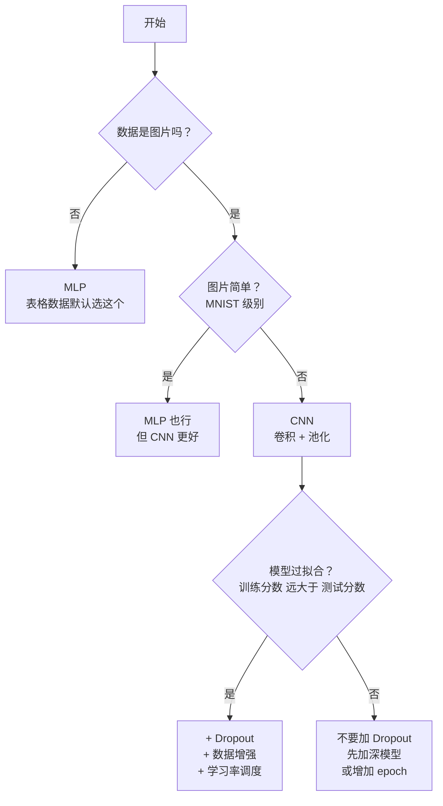

# PyTorch 图像分类实战笔记 —— MNIST & CIFAR-10

基于 PyTorch 的深度学习图像分类笔记，覆盖训练循环、核心函数、模型对比三大部分。

---

## I. 深度学习完整流程

一个完整的深度学习分类项目，分为以下 **6 个阶段**：

```
原始数据 → 加载 → 定义模型 → 训练循环 → 评估 → 保存/部署
.png      分批    搭网络     五步走    打分     导出
```

和 sklearn 最大的区别：sklearn 的 `fit()` 是黑盒，PyTorch 的**训练循环必须自己写**

### 1.1 数据加载（DataLoader）

**目标**：把成千上万张图片切成小包，分批喂给模型

在 sklearn 阶段：泰坦尼克 623 条数据一次全传给 `model.fit(X, y)`，内存完全装得下。但 MNIST 有 60000 张图，一次全塞内存直接爆
`DataLoader` 解决的就是这件事——把大数据集切成一个个 batch，每次只喂一小撮给模型

整个数据流水线如下：
```
datasets.MNIST → transforms.Compose → DataLoader
  拿原始数据          改格式（可选）      分批次
(60000 张图片)   (翻转/旋转/Tensor)    (每包 64 张)
```

| 操作 | 函数 | 作用 |
|------|------|------|
| 下载数据集 | `datasets.MNIST(root, train=True, download=True)` | 数据从哪来？ |
| 转成 Tensor | `transforms.ToTensor()` | 像素 0~255 → 0~1，转成 PyTorch 格式 |
| 分批加载 | `DataLoader(dataset, batch_size=64, shuffle=True)` | 每次喂多少张？要不要打乱？ |

两个数据集规模：

| | 训练集 | 测试集 | 图片尺寸 | 类别 |
|------|--------|--------|---------|------|
| MNIST | 60,000 | 10,000 | 28×28 灰度 | 0~9 数字 |
| CIFAR-10 | 50,000 | 10,000 | 32×32 彩色 | 飞机/汽车/鸟/猫/鹿/狗/青蛙/马/船/卡车 |

**`batch_size` 怎么选**：
太小（比如 8）→ 梯度噪音大，训练不稳定
太大（比如 512）→ 显存放不下。32/64/128 是常见值，CPU 训练用 64 就行

**`shuffle` 为什么重要**：
训练集必须打乱——否则模型会记住数据的排列顺序（比如按标签 0→1→2→... 排列），学到的是"0后面就是1"而不是"数字长什么样"
测试集不需要打乱

**epoch vs batch**：
epoch = 整个数据集完整过了一遍
batch = 每次取一小撮（64 张）
10 个 epoch = 过了 10 遍，每遍切成一包一包

### 1.2 定义模型

**目标**：搭出"输入 → 中间层 → 输出"的计算结构。

```
MLP（表格数据/入门图片）：
  Flatten → Linear → ReLU → Linear → ReLU → Linear → 输出

CNN（图片数据）：
  Conv2d → ReLU → MaxPool → Conv2d → ReLU → MaxPool → Flatten → Linear → 输出
```

**Linear vs Conv2d 的本质差异**：

| | Linear（全连接） | Conv2d（卷积） |
|---|---|---|
| 看什么 | 看全部输入，每个输出和所有输入相连 | 只看一个 3×3 小窗口 |
| 图片怎么处理 | 先 Flatten 拉成一维，丢失空间信息 | 保留二维结构，窗口在图上滑动 |
| 参数量 | 很大（784×128=100352） | 很小（3×3=9，共享权重） |
| 什么时候用 | 表格数据、分类头 | 图片、视频等有空间结构的数据 |

**ReLU 为什么不能省**：
三层的 Linear 不夹 ReLU，数学上等价于一层
ReLU 把负数变成 0，打破了线性关系，多层才有了意义

```
没有 ReLU: Linear(784,128) + Linear(128,64) + Linear(64,10) = Linear(784,10)
有了 ReLU: 三层各学各的，能学到更复杂的规律
```


### 1.3 训练循环

**目标**：让模型一轮一轮地学——猜答案 → 看差多少 → 算该往哪调 → 调一下 → 重复。

```
for epoch in range(10):                    # 整个数据集过 10 遍
    for images, labels in train_loader:    # 每次取 64 张
        optimizer.zero_grad()              # 1.清空上一轮的梯度
        outputs = model(images)            # 2.前向传播——猜答案
        loss = loss_fn(outputs, labels)    # 3.算 loss——看差多少
        loss.backward()                    # 4.反向传播——算每个参数该调多少
        optimizer.step()                   # 5.更新参数——真的去调
```

**这五步的顺序绝对不可乱。** 这等价于 sklearn 的 `fit()` 内部在做的事——区别只是 sklearn 帮你封装好了，PyTorch 让你亲手写。

| 步骤 | 做了什么 | 忘了会怎样 |
|------|---------|-----------|
|  optimizer.zero_grad() | 把上一轮的梯度擦掉 | 梯度越滚越大，loss 不降 |
|  forward | 用当前的 w 和 b 算预测值 | — |
|  loss | 比较预测值和真实答案，计算损失 | — |
|  backward | 从 loss 往回算，算出每个参数该往哪调 | 参数不会更新 |
|  step | 真的去调参数：`w -= lr × w.grad` | 模型不学习 |

zero_grad 虽然标 ①，但它的存在是因为 PyTorch 的 `.grad` 默认**累加**（`+=`），而 numpy 里每次 `dw = ...` 是赋值覆盖，不需要清。这个差异是为了支持 RNN 等需要跨时间步累加梯度的场景。

---

**训练循环等价对照（sklearn → numpy → PyTorch）**：

```python
# sklearn（第二阶段）—— 一行黑盒
model = LogisticRegression()
model.fit(X_train, y_train)

# numpy 手写（理解原理）—— 每一行都透明
for step in range(2000):
    z = X @ w + b                         # 前向
    pred = 1/(1+np.exp(-z))              # sigmoid
    loss = -np.mean(y*log(pred)+...)      # 损失
    dw = (1/n)*X.T @ (pred - y)          # 手动求梯度
    w -= lr * dw; b -= lr * db          # 更新

# PyTorch（第三阶段）—— numpy 的自动化版本
for epoch in range(10):
    for images, labels in train_loader:
        outputs = model(images)            # 前向
        loss = loss_fn(outputs, labels)    # 损失
        optimizer.zero_grad()             # 清梯度（numpy 赋值覆盖不用清）
        loss.backward()                   # 自动求梯度（替代手写 dw/db）
        optimizer.step()                  # 更新参数（替代手写 w-=lr*dw）
```

三行对比，本质一目了然：**PyTorch = numpy 手写逻辑的自动化升级，sklearn = 把整套逻辑封成一个黑盒。**


### 1.4 模型评估

**目标**：看模型在没见过的人身上表现如何。

```python
model.eval()                          # 告诉模型"现在是考试"
with torch.no_grad():                # 关掉梯度记录，省内存
    for images, labels in test_loader:
        outputs = model(images)
        _, predicted = torch.max(outputs, 1)  # 多分类取最大值
        correct += (predicted == labels).sum()
```

**`model.eval()` 为什么重要**：
Dropout 和 BatchNorm 在训练和测试时行为不同
训练时 Dropout 随机关神经元，测试时全部在用，若不切到 eval 模式，测试结果不准

**`torch.no_grad()` 为什么需要**：
评估时不需要求导，但 PyTorch 默认搭计算图（给 backward 指路的）
关掉它省内存、速度快。小数据没感觉，大数据不关可能爆显存

**二分类 vs 多分类的取结果方式**：

```
二分类（泰坦尼克）: pred = (torch.sigmoid(z) >= 0.5).float()
多分类（MNIST）:    _, predicted = torch.max(outputs, 1)   # 10 个分数取最高的
```


### 1.5 模型保存/加载

```python
# 保存——等价于 sklearn 的 joblib.dump
torch.save(model.state_dict(), 'model.pth')

# 加载——必须在加载前先搭一个结构相同的空壳
model = 同样的模型结构()
model.load_state_dict(torch.load('model.pth'))
```

**和 sklearn 的关键区别**：
`joblib.dump` 把结构和参数一起打包
`torch.save` 只保存参数（w 和 b 的值），结构需要自己记住
所以加载时必须先创建结构一模一样的空模型。

---

## II. 重点函数详解

### 2.1 数据加载

#### 2.1.1 数据集下载：`datasets.MNIST()` / `datasets.CIFAR10()`

```python
from torchvision import datasets, transforms

# MNIST
train_data = datasets.MNIST(
    root='data',         # 下载到哪
    train=True,          # True=训练集，False=测试集
    download=True,       # 第一次运行下载，之后跳过
    transform=transforms.ToTensor()  # 对每张图做什么变换
)

# CIFAR-10 —— 写法完全一样，把 MNIST 换成 CIFAR10 即可
train_data = datasets.CIFAR10(root='data', train=True, download=True, transform=...)
```

| 参数 | 说明 | 注意 |
|------|------|------|
| `root` | 数据存放目录 | **用绝对路径**（`os.path.join(PROJECT_DIR, 'data')`），相对路径从不同目录运行会错 |
| `train` | True=训练集，False=测试集 | MNIST: 60K/10K；CIFAR-10: 50K/10K |
| `download` | 第一次设 True 自动下，之后自动跳过 | CIFAR-10 首次下载约 170MB |
| `transform` | 对每张图片应用的变换 | 训练集和测试集**可以用不同的 transform** |

**返回什么**：一个 `Dataset` 对象，里面装着图片和标签。用下标取：`train_data[0]` → `(图片_tensor, 标签)`

#### 2.1.2 数据增强：`transforms.Compose()`

```python
train_transform = transforms.Compose([
    transforms.RandomHorizontalFlip(),        # 随机水平翻转
    transforms.RandomRotation(10),            # 随机旋转 ±10 度
    transforms.RandomAffine(0, translate=(0.1, 0.1)),  # 随机平移 10%
    transforms.ToTensor(),
])
```

**数据增强只在训练集上用**——原理和 sklearn 阶段学到的"测试集不能用 fit_transform"一样：考试时题目不能改

**返回什么**：一个 `transform` 函数对象，传给 `datasets.MNIST(transform=...)` 后，每张图加载时自动执行这套操作

**什么时候用**：数据少（几千张）、模型大（容易过拟合）、目标复杂（真实物体）

#### 2.1.3 创建 DataLoader：`DataLoader()`

```python
train_loader = DataLoader(
    train_data,
    batch_size=64,    # 每次取 64 张
    shuffle=True      # 每 epoch 打乱顺序
)
```

| 参数 | 类型/默认值 | 说明 | 常用值/建议 |
|------|-----------|------|------------|
| `dataset` | Dataset | 数据集对象 | — |
| `batch_size` | int (默认 1) | 每次取多少张 | 32~128。太小→梯度噪音大；太大→显存放不下 |
| `shuffle` | bool (默认 False) | 每 epoch 是否打乱 | 训练集 **True**，测试集 False |
| `num_workers` | int (默认 0) | 用几个子进程加载数据 | 0=主线程。小图（CIFAR-10）开多进程反而慢；大图或重度增强才需要 |
| `pin_memory` | bool (默认 False) | 数据锁在内存，加速 GPU 搬运 | GPU 训练时建议开。CPU 训练没用 |

**`shuffle=True`**（训练） vs **`shuffle=False`**（测试）：测试不需要打乱，因为你只关心分数不关心顺序

**返回什么**：一个可迭代的 loader 对象
`for images, labels in train_loader` 每次吐出一个 batch：`images.shape = [64, 通道, 高, 宽]`，`labels.shape = [64]`。

---

### 2.2 网络层

**层是什么**：
回到 numpy 阶段最熟悉的东西——`z = X @ w + b`
这一步矩阵运算，把 784 个像素变成 128 个数字，就是**一层**

**堆层**：
一个 `Linear` 能力有限，所以把多个 Linear 首尾相接串起来——上一个的输出变下一个的输入
`nn.Sequential` 就是串这些层的绳子

**激活函数干什么**：
问题来了——两个 `Linear` 中间如果不夹任何东西，`Linear₁ → Linear₂` 数学上等价于**一个更大的 `Linear`**
线性变换套线性变换还是线性的，堆一百层也只等于一层

所以必须在两个 Linear 之间夹一个"掰弯"操作——`ReLU`：**把前一层输出的负数全部清零，正数保留**
下一个 Linear 收到的就不再是纯线性的结果了，多层才有了意义

**总结一句**：
`nn.Sequential` 是一根绳子，`Linear` 和 `Conv2d` 是计算单元（层），`ReLU` 是夹在层之间的"掰弯"操作
**这三样加起来 = 神经网络**

和 sklearn 的"模型类"不同——这里的**每个层是零件**，拼起来才是模型。先看完整拼法，再逐个拆解：

```python
# MLP（全连接）—— 表格数据 / 简单图片
model = nn.Sequential(
    nn.Flatten(),              # [64, 1, 28, 28] → [64, 784]
    nn.Linear(784, 128),       # 784 → 128
    nn.ReLU(),
    nn.Linear(128, 64),        # 128 → 64
    nn.ReLU(),
    nn.Linear(64, 10),         # 64 → 10 个类别
)

# CNN （卷积）—— 图片数据
model = nn.Sequential(
    nn.Conv2d(1, 16, kernel_size=3, padding=1),  # 1→16 通道
    nn.ReLU(),
    nn.MaxPool2d(2),                              # 28×28 → 14×14

    nn.Conv2d(16, 32, kernel_size=3, padding=1), # 16→32 通道
    nn.ReLU(),
    nn.MaxPool2d(2),                              # 14×14 → 7×7

    nn.Flatten(),                                 # [batch, 32, 7, 7] → [batch, 1568]
    nn.Linear(1568, 128),
    nn.ReLU(),
    nn.Dropout(0.25),                            # 随机关 25% 神经元，防过拟合
    nn.Linear(128, 10),
)
```
**`nn` 是什么**：
`import torch.nn as nn`，PyTorch 的神经网络工具箱
卷积层、全连接层、激活函数——所有搭网络用的"积木块"都在它下面

**`nn.Sequential` 是什么**：
一个容器，把层按顺序接在一起,前一层的输出自动变成下一层的输入
和工厂流水线一个道理：`Conv2d → ReLU → MaxPool → ...`，不需要手动传数据。

下面逐层拆解，每个零件是干什么的、有哪些参数、注意什么。

---

#### 2.2.1 `nn.Linear` — 全连接层

**本质**：矩阵乘法。`nn.Linear(784, 128)` 做的事：

```
输入 x: [batch, 784]   @   权重 w: [784, 128]   +   偏置 b: [128]
                              ↓
                       输出 y: [batch, 128]
```

公式：`y = x @ w + b`。 每个输出神经元 = 784 个输入各自乘一个权重再加起来。


| 参数 | 含义 | 注意 |
|------|------|------|
| 第1个 (`in_features`) | 输入维度 | **图片必须先 Flatten 拉直** |
| 第2个 (`out_features`) | 输出维度 | 自己定，想大就大想小就小 |

---

#### 2.2.2 `nn.Conv2d` — 卷积层

| 参数 | 含义 | MNIST | CIFAR-10 |
|------|------|-------|---------|
| `in_channels`（第1个） | 输入通道数 | 1（灰度） | 3（RGB） |
| `out_channels`（第2个） | 输出通道数（提取几种特征） | 16 | 16 |
| `kernel_size` | 窗口大小 | 3（3×3） | 3 |
| `padding` | 边缘补零 | 1（保持尺寸不变） | 1 |

**`padding=1` 干什么的**：
不做 padding，3×3 卷积后图片会小一圈
padding=1 在图片外围补一圈零，输出尺寸和输入一样大——方便堆叠多层

**和 Linear 的本质区别**：
Linear 看全局（每个输出连接所有输入），Conv2d 看局部（每个输出只看一个 3×3 窗口）
图像上"相邻像素才有关系"——卷积把这条先验知识编码进了模型结构

**参数量为什么这么小**：
`Conv2d(1→16, 3×3)` = 1×16×9+16 = 160 个
对比 `Linear(784→128)` 的 100,352 个——卷积靠**权重共享**，同一个 3×3 窗口在整张图上滑动，不管图多大

---

#### 2.2.3 `nn.ReLU` — 激活函数

**为什么必须夹在层与层之间**：
没有 ReLU，三层 Linear 数学上等价于一层（`Linear1 + Linear2 + Linear3 = 一个 Big Linear`）
ReLU 把负数变成 0，打破了线性关系，多层才有了意义
还有 Sigmoid、Tanh、GELU 等替代，但 ReLU 最简单最快，入门只用它

---

#### 2.2.4 `nn.MaxPool2d` — 最大池化

| 参数 | 含义 | 默认值 |
|------|------|--------|
| `kernel_size` | 池化窗口大小 | — |

> `stride` 默认等于 `kernel_size`，窗口不重叠——2×2 窗口取一个最大值，正好缩一半。

在 2×2 格子里取最大值，压成一个：`[3,7] / [1,5] → 7`
**卷积层只提取特征不改变尺寸**，Pooling 负责缩小——减少计算量、让下一层卷积看到更大范围

---

#### 2.2.5 `nn.Flatten` — 拉直

| 参数 | 含义 | 默认值 |
|------|------|--------|
| `start_dim` | 从哪个维度开始拉直 | 1 |

> `start_dim=1` 意味着**不碰 batch 维度（dim=0）** 64 张图还是 64 张，后面的 32×7×7=1568 个数字被拉成一行。

卷积输出的三维特征图（通道×高×宽）拉直成一维向量，才能喂给 Linear
**只在 Conv 和 Linear 交界处用一次**

---

#### 2.2.6 `nn.Dropout` — 随机关闭神经元

| 参数 | 含义 | 默认值 |
|------|------|--------|
| `p` | 关闭的比例 | 0.5 |

**为什么需要 Dropout**：
训练时神经元会互相"抱大腿"——A 判断对了 B 就不学了，网络变得依赖特定神经元组合而不是每个独立判断
**这就是过拟合——训练数据上完美，碰到新数据就崩**

**做了什么**：
每轮训练随机关掉 p 的神经元，被关的人这轮"休息"
其他人被迫顶上去，谁都不敢偷懒——逼出**冗余**的判断能力：即使某些神经元不在，剩下的也能正确分类

**训练 vs 测试**：
训练时随机关（制造压力），测试时全部在用（要稳定结果）
这两个模式由 `model.train()` 和 `model.eval()` 自动切换，不需要手动调

**什么时候用**：
只在过拟合时用（训练分数远高于测试分数）模型还在欠拟合时加 Dropout 等于自己削弱自己
在 CIFAR-10 的调参版 CNN 实验已经验证了这一点（基础版 53.20% → 加 Dropout 后 49.99%）

---

### 2.3 损失函数

```python
# 二分类（泰坦尼克）
loss_fn = nn.BCEWithLogitsLoss()

# 多分类（MNIST / CIFAR-10: 0~9，共 10 类）
loss_fn = nn.CrossEntropyLoss()
```

| 损失函数 | 什么时候用 | 输入格式 |
|---------|-----------|---------|
| `BCEWithLogitsLoss` | 二分类（死/活） | 原始 z 值，不需要先做 sigmoid |
| `CrossEntropyLoss` | 多分类（0~9） | 原始分数，不需要先做 softmax |

**"WithLogits"是什么意思**：
Logits = 还没做 sigmoid 的原始值
WithLogits表示损失函数**内部**帮你做了 sigmoid/softmax
所以传给 loss_fn 的是原始 z，不是概率

**为什么内部做更好**：
数学上 `sigmoid + log` 分开算会出数值问题（log(0) 炸了），合在一起算更稳定
你 numpy 里 `+1e-8` 就是在手动防这个问题。

---

### 2.4 优化器与调度器

在进入优化器之前，先搞清楚**梯度是怎么来的**：

#### 2.4.0 `loss.backward()` — 自动求梯度

`backward()` 做的事，就是 numpy 里这一行：

```python
dw = (1/n) * X.T @ (pred - y)    # 手动推导 + 手写梯度公式
```

PyTorch 不需要推公式，`forward` 时它偷偷搭了计算图（记录每一步运算），`backward()` 沿着图反向走一遍
每个参数的**梯度自动填进 `w.grad`**，只是没有显式返回

**重点**：
`backward()` 只算不调，算完存在 `w.grad` 里，下一步 `optimizer.step()` 才去用
所以这两个必须成对出现——一个算方向，一个迈步子

---

优化器和调度器两个东西的职责不同：

- **优化器（SGD）**：必选，对应训练循环 `step()`——真的去调参数。做的事相当于 `w -= lr * dw` 
- **调度器（StepLR）**：**可选**，没有调度器照样可以收敛。本意是"前期大步快跑、后期小步精调"

```python
optimizer = optim.SGD(model.parameters(), lr=0.01)         # 优化器：干活的人
scheduler = optim.lr_scheduler.StepLR(optimizer, ...)      # 调度器：管优化器的人

# 在 epoch 循环里：
optimizer.step()    # 优化器调一次参数
scheduler.step()    # 调度器管一下优化器（lr 减半之类的）
```

#### 2.4.1 `optim.SGD` — 随机梯度下降

```python
optimizer = optim.SGD(model.parameters(), lr=0.01)
```

| 参数 | 含义 | 常用值 |
|------|------|--------|
| `params` | 要管理的参数 | `model.parameters()` |
| `lr`（learning rate） | 步长——每一步迈多大 | 0.01（默认）、0.001（精细任务） |

**SGD 在训练循环中的位置**：`backward()` 算出每个参数的梯度（w.grad），`step()` 真的去调：

```
backward()  →  算出 w.grad（每个参数该往哪调、调多少）
step()     →  w -= lr × w.grad（真的去调）
```

这就是 numpy 手写逻辑回归中 `w -= lr * dw` 的自动化版本

**lr 太大** → 冲过头，loss 震荡不收敛
**lr 太小** → 学太慢，几万步还没到谷底
0.01 是安全的默认值。还有 Adam 等变体（自动调步长），入门先用 SGD 理解本质

#### 2.4.2 `optim.lr_scheduler.StepLR` — 学习率调度

```python
scheduler = optim.lr_scheduler.StepLR(optimizer, step_size=5, gamma=0.5)
# 每 5 个 epoch，学习率 × 0.5（减半）
# epoch 1-5: lr=0.01  →  epoch 6-10: lr=0.005  →  epoch 11-15: lr=0.0025
```

| 参数 | 含义 | 常用值 |
|------|------|--------|
| `optimizer` | 管理的优化器 | — |
| `step_size` | 每隔几个 epoch 调一次 | 5~10 |
| `gamma` | 每次乘多少（<1 就是缩小） | 0.1~0.5 |

**什么时候用**：模型大、epoch 多（30+），后期需要精调，10 个 epoch 的小实验不需要

---

### 2.5 模型持久化

```python
# 保存
torch.save(model.state_dict(), 'model.pth')

# 加载——先搭壳，再填参数
model = 同样的模型结构()
model.load_state_dict(torch.load('model.pth'))
```

| 函数 | 参数 | 说明 |
|------|------|------|
| `torch.save(obj, path)` | 要存的对象, 路径 | 序列化到磁盘 |
| `torch.load(path)` | 文件路径 | 从磁盘反序列化 |
| `model.load_state_dict(dict)` | 参数字典 | 把参数灌进模型 |

**和 sklearn 的关键区别**：
`joblib.dump` 把结构和参数一起打包
`torch.save` 只保存参数（w 和 b 的值），结构需要自己记住。

**为什么只存参数不存结构**：
模型结构是 Python 代码（`nn.Sequential(...)`），不是数据
存代码不安全（序列化代码在不同版本可能不兼容），存参数干净且小

---

### 2.6 常用小工具

这些函数散布在训练和评估循环里，没有大到独立成章，但每个都值得解释一行

#### 2.6.1 `torch.max()` — 取张量最大值

```python
_, predicted = torch.max(outputs, 1)   # dim=1 表示沿类别方向取最大
# outputs 形状: [batch, 10]
# 返回值: (values, indices) 元组，values=每个最大值，indices=最大值的位置
# _ = 最大值本身（不关心），Python 中不关心的值统一用 _ 接收
# predicted = 位置（即类别编号 0~9）
```

**`dim=1` 是什么**：
`dim=0` 是 batch 方向（64 个样本之间比），`dim=1` 是类别方向（10 个分数之间比）
需要的是"每个样本的 10 个分数里哪个最大"，所以 `dim=1`

#### 2.6.2 `loss.item()` — 把 tensor 变成 Python 数字

```python
train_loss += loss.item()   # loss 是 tensor（带着计算图），.item() 变纯数字
```

**为什么不是直接 `loss`**：
`loss` 是 PyTorch tensor——它后面挂着计算图（给 backward 指路的）
`loss.item()` 把它变成普通 Python float，**切断计算图，释放内存**
sum 几万个 batch 的 loss 如果不 `.item()`，内存会炸

#### 2.6.3 `model.parameters()` — 让优化器找到所有参数

```python
optimizer = optim.SGD(model.parameters(), lr=0.01)
```

**它返回什么**：
一个生成器，遍历模型所有层的 w（权重）和 b（偏置）
优化器靠这个列表知道"我该管哪些数字"
model 已通过 `model.to(device)` 搬到了 GPU，所以 parameters 也在 GPU 上

---

## III. MLP vs CNN 详细对比

### 3.1 模型总览

| 维度 | MLP | CNN | CNN + 优化 |
|------|-----|-----|-----------|
| **类型** | 全连接网络 | 卷积神经网络 | CNN + 防过拟合 |
| **适用场景** | 表格数据、简单图片 | **图片** | 复杂图片、数据不足时 |
| **怎么看数据** | Flatten 拉直，丢掉空间信息 | 3×3 窗口滑动，保留二维结构 | 同 CNN |
| **参数量** | ~10 万（784×128+128×64+64×10） | ~20 万 | ~20 万 |
| **训练速度** | 快 | 中 | 慢（数据增强要实时算） |
| **过拟合风险** | 中 | 低（卷积天然防过拟合） | 低（Dropout+增强） |
| **需要标准化** | 不用（ToTensor 已缩放到 0~1） | 不用 | 不用 |
| **MNIST 准确率** | 93.74% | 97.90% | 97.26% |
| **CIFAR-10 准确率** | 41.18% | 53.20% | 49.99% |

> 参数量怎么算的：
>
> MLP: `Linear(784→128)` = 784×128+128 = 100,480；
> `Linear(128→64)` = 128×64+64 = 8,256；
> `Linear(64→10)` = 64×10+10 = 650。合计 ≈ 10.9 万。
>
> CNN: `Conv2d(1→16,3×3)` = 1×16×9+16 = 160；
> `Conv2d(16→32,3×3)` = 16×32×9+32 = 4,640；
> `Linear(1568→128)` = 1568×128+128 = **200,832**；
> `Linear(128→10)` = 128×10+10 = 1,290。合计 ≈ 20.7 万。
>
> 注意：CNN 的参数**绝大多数在分类头**（最后的 Linear），卷积层参数极少——因为权重共享。

### 3.2 为什么 CNN 在图像上比 MLP 强那么多？

**MLP 的致命缺陷**：第一步就把图片 Flatten 拉直了
一个数字"7"的左上角像素和右下角像素被当成两个无关的数字——CNN 知道它们相邻，MLP 不知道

```python
# MLP 看到的是：
[0.0, 0.0, 0.0, 0.5, 0.9, 0.5, 0.0, ...]  # ← 784 个毫无关系的数字

# CNN 看到的是：
┌──────────┐
│ 0  0  0  │  # 左边空白
│ 0  5  9  │  # 中间有一笔 → 这可能是数字！
│ 0  5  0  │
└──────────┘
```

**CIFAR-10 上差距更大（+12%）：** 
因为 CIFAR-10 的物体更复杂——飞机有翅膀、猫有耳朵、车有轮子
这些局部特征 CNN 的 3×3 窗口能捕捉，MLP 的全局 Linear 不行

### 3.3 为什么优化版反而更差？

这不是 bug，是**模型容量和优化技巧不匹配**

**数据增强** → 题目变难了。模型还在学基础，突然加难度反而困惑

**Dropout** → 关掉 25% 神经元。两层 CNN 总共才 20 万参数，还没到"背题目"的过拟合程度——关神经元等于削弱自身能力

**学习率调度** → 提前减速。CIFAR-10 上 10~15 个 epoch 远未收敛，还没到山下就放慢了脚步

**核心判断**：
模型过拟合 → 用优化技巧（降温药）→ 有用
模型欠拟合 → 不要用优化技巧 → 先加深模型、增加 epoch


这和scikit-learn中决策树 'max_depth' 的选择是同一个道理：

| 第二阶段 | 第三阶段 |
|---------|---------|
| max_depth=1 → 学不会（欠拟合） | 两层 CNN + 10 epoch → 刚学了一点（欠拟合） |
| max_depth=5 → 刚好 | 更深网络 + 足够 epoch → 刚好 |
| max_depth=None → 背题（过拟合） | 太深网络 + 太多 epoch → 过拟合 → **这时候用 Dropout** |

### 3.4 模型选择决策树



**总结选模型**：

| 场景 | 选什么 |
|------|--------|
| 表格数据（年龄、性别、舱位...） | MLP |
| 灰度数字、简单分类 | MLP 或 CNN（CNN 更好但 MLP 也够用） |
| 真实物体图片（飞机/猫/车...） | **CNN**（MLP 完全不行） |
| 模型过拟合 | + Dropout + 数据增强 + 学习率调度 |
| 不确定用哪个 | 全跑一遍，看测试准确率选最优 |

### 3.5 常见坑和排错清单

| 坑 | 现象 | 原因 | 解决 |
|----|------|------|------|
| 忘写 zero_grad | loss 震荡不降 | 梯度累加，越滚越大 | 在 backward 前加 `optimizer.zero_grad()` |
| 测试集忘设 eval | 测试准确率不对 | Dropout 在训练测试行为不同 | 评估前加 `model.eval()` |
| 忘写 no_grad | 显存溢出（大数据时） | 计算图在后台攒着 | 评估时加 `with torch.no_grad()` |
| 路径错 | 数据找不到或下到别处 | root 用相对路径 | 用 `os.path.dirname(__file__)` 拼绝对路径 |
| batch_size 太大 | OOM / 内存溢出 | 显存放不下 | 调小到 32 或 16 |
| loss 不下降 | 模型完全不学习 | lr 太大或太小、数据有问题 | 先在 200 条数据上过拟合测试 |
| 优化后分数更低 | 加 Dropout/增强后准确率降 | 模型还在欠拟合，不需要防过拟合 | 先去 Dropout、加深模型、增加 epoch |
| 二分类用了 CrossEntropyLoss | 报错或 loss 异常 | CrossEntropy 期望标签是整数 0~C-1 | 二分类用 BCEWithLogitsLoss |
| Flatten 后 Linear 输入数不对 | shape mismatch | 忘了计算卷积输出尺寸 | 手动算或用 print(model(x).shape) 验证 |
| 训练和测试准确率差距大 | 过拟合 | 模型太强 / 数据太少 | 加 Dropout、数据增强、减小模型 |
| GPU 不工作 | 任务管理器里 GPU 没动 | 没调 `.to(device)`，数据和模型都在 CPU 上 | 模型 + 每批数据都要 `.to(device)` |
| 每次跑结果不一样 | 三次跑出三个不同分数 | PyTorch 默认不固定随机种子（权重初始化、数据 shuffle、cuDNN） | 调用 `set_seed(42)` |

---

## IV. PyTorch vs sklearn：思维对照表

| | sklearn（第二阶段） | PyTorch（第三阶段） |
|---|---|---|
| 训练 | `model.fit(X, y)` 一行 | 五步手写 for 循环 |
| 预测 | `model.predict(X)` | `model(x)` + `torch.max` |
| 评估 | `model.score(X, y)` | 手写 `pred == labels` 统计 |
| 调参 | GridSearchCV 自动搜索 | 手动改网络结构、手动记录结果 |
| 模型保存 | `joblib.dump/load`（结构和参数一起） | `torch.save + load_state_dict`（只存参数） |
| 过拟合判断 | 比较 train/test 准确率数值 | **画 loss/acc 曲线**，看两条线是否分叉 |
| 底层可见度 | 黑盒——不知道 fit 里面在干嘛 | 白盒——每一行都知道在做什么 |
| 随机种子 | 每个函数自带 `random_state` | 需要手动管三个随机源（Python、PyTorch、cuDNN） |
