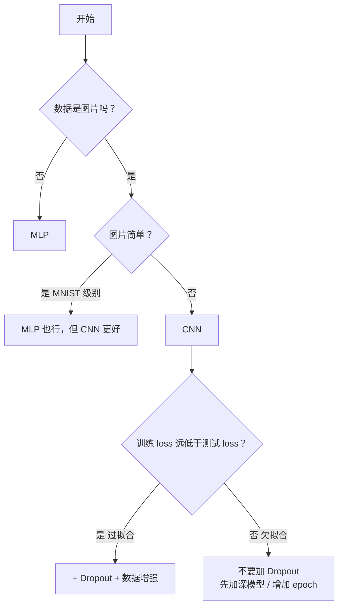

# 从 sklearn 到神经网络

以图像分类（MNIST / CIFAR-10）为主线，记录从传统机器学习迁移到神经网络的学习路径。

> **前置推荐**：如果还不清楚"神经网络到底是什么、为什么能学习"，先看 **3Blue1Brown 的 Neural Networks 系列**

---

## 0. 一切从逻辑回归开始

在进入神经网络前，先回顾传统机器学习中的逻辑回归模型。

### 逻辑回归 = 一个神经元

泰坦尼克数据集：7 个特征（年龄、性别、舱位…），预测死/活。

**numpy 手写版**：

```python
w = np.random.randn(7) * 0.01
b = 0

for step in range(2001):
    z = X @ w + b                           # X(N,7) @ w(7,) = z(N,)：把每行样本的七个特征映射成一个值
    pred = 1 / (1 + np.exp(-z))             # sigmoid：将所有实数压缩成一个(0,1)区间的值，在这里相当于概率了
    loss = -np.mean(y * np.log(pred + 1e-8) + (1-y) * np.log(1-pred + 1e-8)) # 交叉熵，算出loss

    dw = (1/len(X)) * X.T @ (pred - y)      # 手推梯度公式，找到最快降低loss的方向和大小
    db = np.mean(pred - y)
    w -= lr * dw                             # 往梯度反方向迈一步，同时更新参数
    b -= lr * db
```

**PyTorch 版**：

```python
model = nn.Linear(7, 1)                     # 里面就是 7 个 w + 1 个 b
loss_fn = nn.BCEWithLogitsLoss()            # sigmoid + 交叉熵二合一
optimizer = optim.SGD(model.parameters(), lr=0.01)

for step in range(2001):
    z = model(x_t).squeeze()                 # 前向计算
    loss = loss_fn(z, y_t)                   # 计算损失
    optimizer.zero_grad()                    # 梯度清零：防止累加
    loss.backward()                          # 反向传播：自动求梯度
    optimizer.step()                         # 更新参数：w -= lr*dw
```

两段代码做的是同一件事。
区别只有两个：梯度从"手推公式"变成了 `backward()`，参数更新从 `w -= lr*dw` 变成了 `optimizer.step()`。


### 一层 → 多层 → 神经网络

逻辑回归是 **7 个输入 → 1 个输出**，中间没有隐藏层。

神经网络的做法是：在输入和输出之间**多塞几层**，每层由很多个"逻辑回归"并排干活：

```
逻辑回归（单层）:    input(N,7)  →  输出1个z  →  sigmoid算概率  →  死/活

神经网络（多层）:    input(N,784) →  hidden₁(N,128) →  hidden₂(N,64) →  output(N,10)
                    ↑ 矩阵乘法      ↑ ReLU 消线性     ↑ ReLU            ↑ 10 个分数
```

**每一层本质上还是一个矩阵乘法 `y = x @ W^T + b`**，和逻辑回归一模一样。多出来的东西就两样：

1. **ReLU**——夹在层与层之间，就是这个运算：a=max(0,a)
2. **softmax / CrossEntropyLoss**——输出从 1 个分数变成 10 个分数，选最大的作为预测类别。

>因此，逻辑回归在数学上和神经网络完全等价，可以理解成是最简单的一种神经网络。

如果看不懂也问题不大，后面的章节就是把这个框架拆开，一个一个零件讲清楚。

---

## I. 深度学习完整流程

完整的深度学习分类项目，分六个阶段：

```
原始数据 → 加载 → 定义模型 → 训练循环 → 评估 →  保存
.png      分批    搭网络     五步走    打分   导出
```

**和 sklearn 最大的区别**：sklearn 的 `fit()` 是黑盒，PyTorch 的**训练循环必须自己写**。

### 1.1 数据加载（DataLoader）

sklearn 阶段，泰坦尼克 623 条数据一次全传 `model.fit(X, y)`，内存装得下；MNIST 有 60000 张图，一次全塞内存不友好。
所以需要分批喂——这就是数据加载要解决的问题。

**整体架构**

```
 .png  →  Dataset  →  transform  →  DataLoader  →  训练循环
            读           处理     "堆成一叠"      "喂给模型"
```

| 角色 | 干什么 | 输入 → 输出 |
|------|--------|-------------|
| `Dataset` | 读数据 | `train_data[0]` → `(PIL Image, 标签 5)` |
| `transform` | 做预处理 | PIL Image → `torch.Tensor`，像素 0~255 → 0~1 |
| `DataLoader` | **堆成一叠** | 64 个 `(1,28,28)` → `(64,1,28,28)` |
| 训练循环 | 拿 batch 喂模型 | `model(images)`，不再关心数据怎么来的 |

两个关键认知：

**① transform 是懒加载**。`datasets.MNIST(transform=...)` 只是记下"将来用这个函数"，不调用。真正调用是在 `train_data[0]` 取数据那一刻——从磁盘读到 PIL Image，立刻丢给 transform。所以 `RandomHorizontalFlip` 每次取同一张图都可能不同，这才是数据增强的本质。

**② shape 在这条链路里变了两次**：

```
Dataset 取出单条 → transform 处理后          → DataLoader 堆叠后
PIL, H×W           tensor, (1, 28, 28)        (64, 1, 28, 28)
                   ↑ C 在最前（PyTorch 约定）   ↑ 沿 dim=0 叠了 64 条
```

`(batch, 通道, 高, 宽)` 是 PyTorch 所有视觉层的硬约定，Conv2d 等都按这个顺序读。

#### 参数速查

- **`batch_size`**：每批多少张。太小（8）梯度不稳，太大（512）显存放不下。CPU 训练用 64。
- **`shuffle`**：训练集打乱，测试集不打。不打乱的话模型会记住标签顺序而不是图片特征。
- **epoch vs batch**：1 个 batch = 模型更新一次；1 个 epoch = 全数据集过一遍 = `60000/batch_size` 个 batch。

### 1.2 定义模型

搭出"输入 → 中间层 → 输出"的计算结构：

```
MLP（表格数据 / 简单图片）：
  Flatten → Linear → ReLU → Linear → ReLU → Linear → 输出

CNN（图片数据）：
  Conv2d → ReLU → MaxPool → Conv2d → ReLU → MaxPool → Flatten → Linear → 输出
```

**Linear vs Conv2d 的本质差异**：

| | Linear（全连接） | Conv2d（卷积） |
|---|---|---|
| 看什么 | 看全部输入，每个输出和所有输入相连 | 只看一个 3×3 小窗口 |
| 图片怎么处理 | 先 Flatten 拉成一维，丢失空间信息 | 保留二维结构，窗口在图上滑动 |
| 参数量 | 很大（784×128=100352） | 很小（3×3=9，权重共享） |
| 什么时候用 | 表格数据、分类头 | 图片、视频等有空间结构的数据 |

**ReLU 为什么不能省**：`Linear → Linear` 数学上等价于一个更大的 `Linear`（矩阵乘法满足结合律）。ReLU 把负数清零，打破了线性关系，多层才有了意义。

### 1.3 训练循环

让模型一轮一轮地学——猜答案 → 看差多少 → 算该往哪调 → 调一下 → 重复。

```
for epoch in range(10):
    for images, labels in train_loader:
        optimizer.zero_grad()              # 1.清空上一轮的梯度
        outputs = model(images)            # 2.前向传播——猜答案
        loss = loss_fn(outputs, labels)    # 3.算 loss——看差多少
        loss.backward()                    # 4.反向传播——算每个参数该调多少
        optimizer.step()                   # 5.更新参数——真的去调
```

这五步的顺序绝对不可乱。这等价于 sklearn `fit()` 内部在做的事——区别只是 sklearn 封装好了，PyTorch 让你亲手写。

| 步骤 | 做了什么 | 忘了会怎样 |
|------|---------|-----------|
| ① zero_grad | 把上一轮的梯度擦掉 | 梯度越滚越大，loss 不降 |
| ② forward | 用当前的 w 和 b 算预测值 | — |
| ③ loss | 比较预测值和真实答案 | — |
| ④ backward | 从 loss 往回算，算出每个参数该往哪调 | 参数不会更新 |
| ⑤ step | `w -= lr × w.grad`，真的调参数 | 模型不学习 |

**为什么 PyTorch 需要 zero_grad 而 numpy 不需要**：PyTorch 的 `.grad` 默认**累加**（`+=`）而不是覆盖。
这是设计选择——累加让你可以跨多个 batch 攒梯度、攒够再一起更新（等效于更大的 batch_size）。
numpy 里每次 `dw = ...` 是赋值覆盖，所以不需要清。对单 batch 更新来说，这个"默认累加"就成了上一轮的残留，必须用 zero_grad 清掉。

**三行对比，本质一目了然**：

```python
# sklearn —— 一行黑盒
model.fit(X_train, y_train)

# numpy 手写 —— 每一行都透明
z = X @ w + b
pred = 1/(1+np.exp(-z))
loss = -np.mean(y*log(pred) + (1-y)*log(1-pred))
dw = (1/n)*X.T @ (pred - y)
w -= lr * dw

# PyTorch —— numpy 的自动化版本
outputs = model(images)
loss = loss_fn(outputs, labels)
loss.backward()            # 替代手写的 dw/db
optimizer.step()           # 替代 w -= lr*dw
```

### 1.4 模型评估

看模型在没见过的数据上表现如何：

```python
model.eval()                          # 切到测试模式
with torch.no_grad():                 # 关掉梯度记录，省内存
    for images, labels in test_loader:
        outputs = model(images)
        _, predicted = torch.max(outputs, 1)   # 10 个分数取最大的
        correct += (predicted == labels).sum()
```

**`model.train()` 和 `model.eval()` 是成对的**——训练前调 `train()`，评估前调 `eval()`。
Dropout 和 BatchNorm 在两种模式下行为不同：训练时 Dropout 随机关神经元，测试时全部在用。忘切换会导致评估结果不准。

**`torch.no_grad()` 为什么需要**：评估时不需要求导，但 PyTorch 默认搭计算图（给 backward 指路的）。关掉它省内存、速度快。

**二分类 vs 多分类的取结果方式**：

```
二分类（泰坦尼克）: pred = (torch.sigmoid(z) >= 0.5).float()
多分类（MNIST）:    _, predicted = torch.max(outputs, 1)   # 10 个分数取最高
```

### 1.5 模型保存 / 加载

```python
# 保存——只存参数（w 和 b 的值）
torch.save(model.state_dict(), 'model.pth')

# 加载——必须先搭一个结构相同的空壳
model = 同样的模型结构()
model.load_state_dict(torch.load('model.pth'))
```

**和 sklearn 的关键区别**：`joblib.dump` 把结构和参数一起打包；`torch.save` 只保存参数，结构需要自己记住。因为模型结构是 Python 代码不是数据，存代码不安全（版本兼容性），存参数干净且小。

---

## II. 核心组件


### 2.1 数据加载

先看完整搭建代码，再逐个拆解：

```python
train_transform = transforms.Compose([           # 训练集增强流水线
    transforms.RandomHorizontalFlip(),           # 每次被调用时以默认概率 50% 做左右镜像
    transforms.RandomRotation(10),               # 每次在 [-10°, +10°] 内随机选一个角度旋转图片
    transforms.RandomAffine(0, translate=(0.1, 0.1)), # 不旋转（第一个参数=0），横纵方向最多平移图片尺寸的 10%
    transforms.ToTensor(),
])
test_transform = transforms.ToTensor()           # 测试集只转 Tensor

train_data = datasets.MNIST(root=DATA_DIR, train=True,  download=True, transform=train_transform)
test_data  = datasets.MNIST(root=DATA_DIR, train=False, download=True, transform=test_transform)
train_loader = DataLoader(train_data, batch_size=64, shuffle=True)
test_loader  = DataLoader(test_data, batch_size=64, shuffle=False)
```

#### 2.1.1 `transforms.Compose()` :数据处理

**`Compose`**——就是一个顺序调用器，内部接受一个列表。`Compose([A, B, C])` 等价于 `C(B(A(img)))`。

这里训练集进行了增强处理，所以显式调用Compose，测试集由于只需要转Tensor，故省略
**但其实`transforms.ToTensor()`和`transforms.Compose([transforms.ToTensor()])`完全等价**

**Compose返回一个transforms对象，在正式读取数据集时作为参数调用，直接进行处理。**

**测试集如果做了翻转/平移，测出来的准确率失真，无法衡量模型在真实数据上的表现。**

#### 2.1.2 ToTensor():图片转张量

| | 变之前 | 变之后 |
|------|--------|--------|
| 类型 | PIL Image / numpy | `torch.Tensor` |
| 维度 | `H(高度) × W(宽度) × C(通道)` | `C × H × W` |
| 数值 | uint8, 0~255 | float32, 0.0~1.0 |

PIL库是 HWC 格式，但 PyTorch 的 Conv2d 等层全按 CHW 解释，必须把图片转成指定格式的Tensor张量，所以**训练/测试集都有ToTensor()。**

**Compose内部增强变换必须放 `ToTensor` 前面**——它们操作的是 PIL Image，而非 Tensor 张量。


#### 2.1.3 `datasets.MNIST()`：数据读取

```python
train_data = datasets.MNIST(
    root='data',                    # 数据存哪
    train=True,                     # True=60000 训练集 / False=10000 测试集
    download=True,                  # 首次运行从网上下载，之后自动跳过
    transform=train_transform       # 使用前面compose返回的对象进行流水线处理
)
```

`train_data[0]` 被访问时内部做了什么：

1. 从磁盘读第 0 张图片 → PIL Image（28×28，像素 0~255）
2. 读标签（整数 0~9）
3. 如果 `self.transform` 不为空 → `img = self.transform(img)`
4. 返回 `(img, label)`

每次 `train_data[i]` 都重新读磁盘、重新跑 transform。这就是为什么 1.1 说 transform 是懒加载。

`CIFAR10` 接口完全一致，只是内部读的是 32×32 彩色图，标签是字符串类别名。


#### 2.1.4 `DataLoader()`：数据分批

```python
train_loader = DataLoader(train_data, batch_size=64, shuffle=True)

for images, labels in train_loader:
```
迭代内部：

1. **排顺序**——`shuffle=True` 时生成随机索引排列 `[3847, 12, 59123, ...]`
2. **切 batch**——每次取 `batch_size` 个索引，如 `[3847, 12, ..., 777]`（64 个）
3. **逐条取**——对这 64 个索引 i 依次读取train_data[i]，进行64 次 transform，得到每张图片对应的Tensor
4. **堆叠（collate）**——默认行为：64 个 tensor 沿 dim=0 堆成 `(64, C, H, W)`，相当于把64张图片的信息堆叠

>每次迭代返回的`images`就是让机器看的题，`labels`就是题目的标准答案，最终要通过`loss_fn(model(images),labels)`计算loss

| 参数 | 作用 |
|------|------|
| `batch_size` | 每批多少条 |
| `shuffle` | True=每个 epoch 开始时重新生成随机索引排列 |
| `num_workers` | 多进程读数据，0=主线程，MNIST 用 0 够 |
| `pin_memory` | 锁页内存，仅 GPU 训练时有用 |

### 2.2 网络层

CNN 模型定义（以 CIFAR-10 为例，5 层卷积 + BatchNorm）：

```python
model = nn.Sequential(
    # --- 卷积部分：逐层提取特征 ---
    nn.Conv2d(3, 16, 3, padding=1),     # (batch, 3, 32, 32) → (batch, 16, 32, 32)   低级特征（边缘/纹理）
    nn.BatchNorm2d(16),                  # 拉回标准范围，稳定训练
    nn.ReLU(),                           # 非线性激活，负数清零
    nn.MaxPool2d(2),                     # → (batch, 16, 16, 16)   尺寸缩为 1/4

    nn.Conv2d(16, 32, 3, padding=1),    # → (batch, 32, 16, 16)
    nn.BatchNorm2d(32),
    nn.ReLU(),
    nn.MaxPool2d(2),                     # → (batch, 32, 8, 8)

    nn.Conv2d(32, 32, 3, padding=1),    # → (batch, 32, 8, 8)     连续卷积，通道不变，特征更抽象
    nn.BatchNorm2d(32),
    nn.ReLU(),

    nn.Conv2d(32, 64, 3, padding=1),    # → (batch, 64, 8, 8)
    nn.BatchNorm2d(64),
    nn.ReLU(),

    nn.Conv2d(64, 128, 3, padding=1),   # → (batch, 128, 8, 8)
    nn.BatchNorm2d(128),
    nn.ReLU(),
    nn.MaxPool2d(2),                     # → (batch, 128, 4, 4)

    # --- 分类头：全局特征 → 类别分数 ---
    nn.Flatten(),                        # → (batch, 2048)   128×4×4 展成一维
    nn.Linear(2048, 512),               # → (batch, 512)    全连接：所有特征参与投票
    nn.ReLU(),
    nn.Dropout(0.25),                    # 训练时随机置零 25%，防过拟合
    nn.Linear(512, 128),                # → (batch, 128)
    nn.ReLU(),
    nn.Dropout(0.25),
    nn.Linear(128, 10),                 # → (batch, 10)    输出 10 个类别的原始分数
).to(device)
```

每个层本质上都是**对输入张量做一次数学运算**。
**参数（w 和 b）在层内部，`model.parameters()` 在定义时就把它们传入优化器。**

**请注意**：Sequential 就像一个流水线容器——数据 `x` 传入后按顺序依次过每一层，不需要手动把上一层的输出传给下一层。
这和 2.1.1 的 `Compose` 是同一个设计模式。

三类操作，一目了然：**Conv2d/Linear 改通道数，MaxPool 缩尺寸，ReLU/BN/Dropout 只改值不改形状。**

下面逐个拆解每一层。

#### 2.2.1 基础层 —— 构建 CNN 必须的五件套

这五层缺一个模型就跑不起来：Linear 做全连接映射、ReLU 引入非线性、Conv2d 提取空间特征、MaxPool 缩小尺寸、Flatten 把卷积输出转成全连接能吃的格式。


##### 2.2.1.1 `nn.Linear(in_features, out_features)`：线性层/全连接层

**底层运算**：

```
输入 x: (batch, in_features)   @   W.T: (in_features, out_features)    +    偏置 b: (out_features,)
                                            ↓
                                  输出 y: (batch, out_features)
```

即 `z = X @ W.T + b`，和 numpy 手写逻辑回归的 `z = X @ w + b` 是**同一件事**——区别只是 w 从向量 `(7,)` 变成了矩阵，因为输出从 1 个数变成了 out_features 个数。

**内部工作原理**：

**__init__ 时创建了以下参数：**
  weight: (out_features, in_features)    ← 初始值是随机的，训练中会被优化器更新
  bias:   (out_features,)                ← 初始值是 0
**注意：weights形状与输入相反，所以需要右乘其倒置矩阵，之所以这么设计纯粹是早年底层设计，无需在意**

**前向传播干了什么：**
  output = input @ weight.T + bias
  即 (batch, in) @ (in, out) + (out,) → (batch, out)

  把每个样本的 in_features 个输入特征，和 weight 权重矩阵相乘，映射成 out_features 个输出值，每个输出再加一个偏置bias。

所以 **一个 `nn.Linear(784, 128)` 就是 128 个逻辑回归并排干活**，每个输出神经元和全部 784 个输入相连，各有自己的 784 个权重 + 1 个偏置。参数量 = 784×128 + 128 = 100,480。


```python
# MNIST MLP 的三层 Linear
nn.Linear(784, 128)    # 输入: (batch, 784) → 输出: (batch, 128)
nn.Linear(128, 64)     # 输入: (batch, 128) → 输出: (batch, 64)
nn.Linear(64, 10)      # 输入: (batch, 64)  → 输出: (batch, 10)（10 个类别分数）
```


##### 2.2.1.2 `nn.ReLU()`：激活函数

**原理**：`ReLU(x) = max(0, x)`

**不创建、不存储、不更新任何东西。唯一的作用就是把本层的负数截掉，打破层与层之间的线性关系。**

```python
ReLU([-3, -1, 0, 2, 5]) = [0, 0, 0, 2, 5]
```

**为什么必须夹在层与层之间**：
两个 Linear 中间不夹任何东西，`Linear₁ → Linear₂` 数学上 = 一个更大的 `Linear`。
因为 `(x @ W₁^T) @ W₂^T = x @ (W₁^T @ W₂^T)`，矩阵乘法满足结合律，堆多少层也只等于一层。

`ReLU` 不是线性的（没法用矩阵乘法实现"负数清零"），使用它可以给全连接层引入非线性，增加拟合能力。
所以 `Linear → ReLU → Linear` 无法被合并——每层真的在学不同的东西。
激活函数还有 Sigmoid、Tanh、GELU 等变体，但 ReLU 相对好理解。


##### 2.2.1.3 `nn.Conv2d(in_channels, out_channels, kernel_size, padding)`：卷积层

**底层运算**：和 Linear 的全局矩阵乘法不同，卷积是一个 3×3 小窗口在图片上**滑动**，每个位置做一次局部点积。

**内部工作原理**：__init__ 时创建 weight 和 bias：
```
weight: (out_channels, in_channels, kernel_size, kernel_size) 随机初始化，训练中更新
bias:   (out_channels,) 初始值为 0
```

**通道**：以 `Conv2d(3, 16, kernel_size=3, padding=1)` 为例。输入是一张 CIFAR-10 彩色图，shape = (3, 32, 32)：把它理解成 3 层 32×32 的纸叠在一起——R 层、G 层、B 层，每层一个二维网格。

**"通道"就是"一层纸"——输入有 3 个通道 = 3 层。**

`out_channels=16` 个卷积核，每个 shape = [3, 3, 3] = [输入通道数, 高, 宽]。
3 层各一个 3×3 小权重矩阵，共 3×9 = 27 个权重，和输入的 3 个通道一一对应。

**滑动计算**：卷积核只在平面上（H 和 W 方向）滑动，不在通道方向滑动。滑到 (i,j) 时：
      从 R 层取 3×3 小块 × 卷积核第 1 层权重
    + 从 G 层取 3×3 小块 × 卷积核第 2 层权重
    + 从 B 层取 3×3 小块 × 卷积核第 3 层权重
    + bias
    = 一个数

>通俗讲：卷积核一次性看完所有通道的同一位置区域，融合成一个数。

一个卷积核扫完 32×32 全图，产出结果形状 (32,32)——这就是一个输出通道。16 个卷积核，每个产出一个输出通道，所以最终输出 shape = (16, 32, 32)。

**输出通道不再是 R/G/B，而是 16 种"这个卷积核想检测的东西"**——比如某个通道对边缘敏感，某个对纹理敏感。至于具体检测了什么，由训练决定。

**和 Linear 的本质区别**：Linear 看全局（每个输出连接所有输入），Conv2d 看局部（每个输出只看一个 3×3 窗口）。

**参数量为什么极小**：`Conv2d(1, 16, 3)` = 1×16×9 + 16 = **160 个参数**,对比 `Linear(784, 128)` 的 100,352 个。
卷积靠**权重共享**——同一个 3×3 窗口在整张图上滑动，不管图多大，参数只和窗口有关。

**`padding=1` 干什么**：不做 padding，3×3 卷积后图片会小一圈（28×28 → 26×26）。padding=1 在图片外围补一圈零，输出尺寸和输入一样大，方便堆叠多层。

>图像上"相邻像素才有关系"——卷积把这条先验知识编码进了模型结构。这就是为什么 CNN 在图片上碾压 MLP。

```python
# MNIST: 灰度图（1 通道）
nn.Conv2d(1, 16, kernel_size=3, padding=1)    # (batch, 1, 28, 28) → (batch, 16, 28, 28)

# CIFAR-10: 彩色图（3 通道 RGB）
nn.Conv2d(3, 16, kernel_size=3, padding=1)    # (batch, 3, 32, 32) → (batch, 16, 32, 32)

# 通道数不变：加深网络，逐层抽象（ReLU 夹在中间，不会被合并成一层）
nn.Conv2d(32, 32, kernel_size=3, padding=1)   # (batch, 32, H, W) → (batch, 32, H, W)
```


##### 2.2.1.4 `nn.MaxPool2d(kernel_size)`：最大池化

**做的事**：在 kernel_size*kernel_size 的格子里取最大值max，将整格数据压成max。
每次移动格数`stride` 默认等于 `kernel_size`，以此保证窗口不重叠。

**内部工作原理**：

```
前向传播时，把输入切分成不重叠的 k×k 小窗口（比如 2×2），
每个窗口只保留最大值，丢弃其余三个数。

输入 2×2: [3, 7]
          [1, 5]   →  输出: 7（四个值里最大的那个）

整张图: 28×28 → 切成 14×14 个 2×2 窗口 → 输出 14×14
```

最大池化不可避免地会丢失大量数据，但这正是它的价值：
- 降低每层计算量：kernel_size越大，降低越多；卷积层只提取特征不缩小尺寸，一直不缩的话计算量会爆炸。
- 保留区域最强信号：避免被其他弱信号稀释。

**为什么需要**：Pooling 负责缩小——28×28 → 14×14 → 7×7，每步面积缩到 1/4，也让下一层卷积看到更大范围。

>和卷积的配合逻辑：卷积负责"提取什么"（学习 weight），池化负责"缩尺寸"（固定运算）。


##### 2.2.1.5 `nn.Flatten()`：拉直

**做的事**：把卷积输出的三维特征图（通道×高×宽）拉成一维向量，才能喂给 Linear。

**内部工作原理**：

```
前向传播时，保持 batch 维不动，把后面所有维度合并成一个：
  (batch, 32, 7, 7)  →  (batch, 1568)
          ↑ 32×7×7=1568 个数字排成一行

数据本身没有修改，只是从三维展成了一维。
```

```python
输入:  (batch, 32, 7, 7)      # batch × 32 通道 × 7×7 特征
输出:  (batch, 1568)           # batch × 1568 ：1568 个数字排成batch行
```

**只在即将开始 Linear 处用一次。**

#### 2.2.2 优化层 —— 稳定训练 + 防止过拟合

这两层不是必需的——两层 CNN 不加也能跑。
但当网络加深（≥3 层卷积），BatchNorm 是训练稳定的前提条件；
当模型开始过拟合，Dropout 才派上用场。


##### 2.2.2.1 `nn.BatchNorm2d(num_features)`：批量标准化

**`num_features` 就是上一层卷积的 `out_channels`。**

**底层运算**：在卷积层输出后、ReLU 激活前，**把数据"拉回标准范围**——减均值、除标准差，强制把数据拉回标准范围。
不管上一层参数怎么变，下一层收到的输入永远合理。

**重要性**：没有 BatchNorm 时，5 层卷积的 CIFAR-10 准确率直接崩到 **20%**，加了 BN 后一条线没改就跳到 **80%**。

```
无 BN:  输入 → [Conv1] → 输出值偏大 → [Conv2] → 逐层放大 → [Conv5] → 梯度爆炸
有 BN:  输入 → [Conv1] → [标准化：均值0方差1] → [Conv2] → [标准化] → ... → 稳定
```

>**每一层参数更新都会改变它输出的数值范围，前一层的小变化传到后面被逐层放大——5 层可能从正常的 [−1, 1] 飘到 [−500, 500]，梯度直接爆炸。**

**内部工作原理**：
```python
# 对一个 batch 的某层输出（如 shape=[64, 16, 32, 32]）：

# 1. 算当前 batch 的均值和方差——注意是"每个通道各自算"：
#    在 (batch, 高, 宽) 三个维度上统计，16 个通道就是 16 对 (mean, var)
mean = x.mean(dim=(0, 2, 3), keepdim=True)   # shape=(1, 16, 1, 1)，比如某通道是 2.3
var  = x.var(dim=(0, 2, 3), keepdim=True)    # 同一通道内再算方差，比如 5.1

# 2. 标准化：减均值、除标准差
x_norm = (x - mean) / sqrt(var + 1e-5)    # 每个通道现在均值≈0, 方差≈1

# 3. 缩放 + 平移（可学习参数！）
output = gamma * x_norm + beta
#        ↑ 每个通道一对 gamma/beta，训练中学习出来，不被"锁死"在 0 附近
```

**`gamma` 和 `beta` 是关键**：
没有它们，数据被强制压在 0 附近，网络丧失表达能力。
有了这两个可学习参数，模型可以自己决定"放大多少、往哪偏移"，既享受了标准化的稳定性，又保留了该有的自由度。

**训练/测试行为不同**

和 Dropout 一样，BatchNorm 在 `train()` 和 `eval()` 下行为不同：

| 模式 | 用什么算均值/方差 |
|------|------------------|
| `model.train()` | **当前 batch** 的均值/方差（带随机性，相当于轻微噪声） |
| `model.eval()` | **训练阶段攒下来的全局均值/方差**（稳定、可复现） |

这就是为什么评估时必须调 `model.eval()`——否则 BN 还在用当前 batch 的统计量，结果会跑偏。

**位置固定**：`Conv2d → BatchNorm → ReLU → MaxPool`，这个顺序是大量实验验证出来的最佳实践。

**实践经验**：第一次尝试 5 层 CNN 时不知道需要加 BN，准确率 20% 比瞎猜（10%）好不了多少。
> **加了 BN 后所有参数没动，直接到 80%。BatchNorm 是深层网络能训练起来的前提条件，不是可选的装饰品。**

**和 Dropout 的区别**

| | BatchNorm | Dropout |
|---|---|---|
| 解决什么 | **训练不稳定**（深层网络梯度爆炸/消失） | **过拟合**（模型死记硬背训练集） |
| 什么时候加 | 网络超过 3 层就**必须加** | 确定过拟合后才加 |
| 作用位置 | 卷积层后、ReLU 前 | 全连接层中 |


##### 2.2.2.2 `nn.Dropout(p)`：随机关闭神经元

**做的事**：每轮训练随机关掉 p 比例的神经元，被关的人这轮"休息"。其他人被迫顶上去，逼出冗余的判断能力。

**内部工作原理**：

```
训练时 model.train()：
    以概率p，随机把输入张量里面部分元素置0

测试时 model.eval()：
    什么都不做——输入原样通过，所有神经元都在岗。
```

`model.train()` 和 `model.eval()` 切换时，Dropout 是行为变化最明显的层——训练时随机关人，测试时全员到齐。
这就是为什么忘写 `eval()` 测试分数会偏低。

**谨慎使用**：实际项目中，CIFAR-10 CNN 加了 Dropout 后准确率从 53.20% **掉到** 49.99%。
原因是两层 CNN 远没到过拟合——还在学基础，关神经元等于削弱。

>**这已经被证明是一种有效的正则化技术**


### 2.3 损失函数

损失函数回答一个问题：**模型猜的答案和真实答案差多少？** 差得多就罚重一点，反向传播时梯度大，参数调得猛；差得少就轻罚。

模型输出的是一堆原始分数（z），有时候正有时候负，不能直接和标签比较。**分类任务中，损失函数内部做了两件事：**

```
原始分数(z)  →  sigmoid / softmax     →     Cross-Entropy(-log)  →      loss
                  ↑ 第一步                          ↑ 第二步
                  输出变概率                      概率变"错多大"
```

PyTorch 提供了两个封装好这两步的损失函数：

| | BCEWithLogitsLoss | CrossEntropyLoss |
|---|---|---|
| 输出转概率函数 | sigmoid | softmax |
| 概率转loss函数 | 二分类交叉熵 | 多分类交叉熵 |
| 适用场景 | 二分类 | 多分类（3 类及以上） |
| 标签格式 | 0.0 或 1.0（float） | 0, 1, 2...（long，类别编号） |
| 示例 | 泰坦尼克 | MNIST, CIFAR-10 |

> 两个损失函数默认都对 batch 内所有样本**取平均**（`reduction='mean'`），返回一个**标量**。

**训练循环中的实际用法**

```python
# 多分类（MNIST / CIFAR-10）
loss_fn = nn.CrossEntropyLoss()
outputs = model(images)          # (batch_size, 10)，原始分数，不要 softmax
loss = loss_fn(outputs, labels)  # 返回一个标量：batch 内所有样本 loss 的平均值
loss.backward()

# 二分类（泰坦尼克）
loss_fn = nn.BCEWithLogitsLoss()
outputs = model(x).squeeze()     # (batch_size,)，1 个原始分数
loss = loss_fn(outputs, y)       # 返回一个标量：batch 内所有样本 loss 的平均值
loss.backward()
```

#### 2.3.1 sigmoid/softmax：输出变概率 

两个函数做的事看起来差不多："把任意实数压成 (0,1) 之间的概率"。但底层逻辑完全不同。

**sigmoid：各管各的，互不干扰**

```
z = 5.0  →  sigmoid(5.0) = 0.993   # 大概率是 1
z = 0.0  →  sigmoid(0.0) = 0.500   # 完全不确定
z = -3.0 →  sigmoid(-3.0) = 0.047  # 大概率是 0
```

sigmoid 只盯自己这一个分数，不管别人。10 个输出全部走 sigmoid，10 个概率加起来可能是 8.3，也可能只有 0.37——**没有"总和为 1"的约束**。

这意味着 sigmoid 回答的是**独立的判断题**。

**softmax：互相竞争，此消彼长**

假设模型对一张"7"的图片输出了 10 个分数：

```
z = [0.2, 0.1, 0.5, 0.3, 1.2, 0.8, 2.0, 5.0, 0.4, 0.6]

softmax:  所有分数取 exp → 全部除以总和 → 强制概率和为 1
        [0.007, 0.007, 0.010, 0.008, 0.020, 0.013, 0.043, 0.873, 0.009, 0.011]
                                                            ↑ 数字 7：87.3%
```

softmax 看的是**所有 N 个分数之间的关系**——抬高一个概率，必然压低其他全部。模型不能同时说"90% 是 7"和"90% 是 3"，概率池总共就 100%。

**核心区别**：

> **sigmoid 做"是不是"——N 道独立的是非题。softmax 做"是哪一个"——N 选 1 的单选题。**

这决定了它们各自的使用场景：

| | sigmoid | softmax |
|---|---|---|
| 概率关系 | 独立，各管各 | 互斥，总和为 1 |
| 适用场景 | 二分类、**多标签分类**（一张图同时有猫又有狗） | **多分类**（一个数字只能是 7 不能同时是 3） |
| 模型在学什么 | 每道题独立判断"是/不是" | 所有类别竞赛，选最可能的 |

二分类是特例：两个概率此消彼长，知道一个就知另一个。此时 softmax 等价于对两个分数之差做 sigmoid，所以二分类用哪个损失函数都可以，BCEWithLogitsLoss 更直接。

**这就解释了为什么 MNIST 不能把 CrossEntropyLoss 换成 BCEWithLogitsLoss**：
不是因为"接口不匹配"——技术上完全可以把 10 个输出每个接一个 sigmoid，但这等于问 10 道独立的是非题，模型会偷懒。
而 MNIST 的标签本身就是互斥的（一个数字不能同时是 7 和 3），softmax 把这个先验知识编码进了数学——让 10 个类别互相竞争，梯度推动赢家通吃。


#### 2.3.2 Cross-Entropy（交叉熵）：概率变 loss

概率有了，怎么用一个数字衡量"猜得有多错"？

直觉：正确答案的那个位置，概率**越高越好**。那就对它取 `-log`——因为 -log 曲线天然满足：

```
概率 = 0.9  →  -log(0.9) = 0.105    （猜得不错，略罚）
概率 = 0.5  →  -log(0.5) = 0.693    （一半一半，中罚）
概率 = 0.01 →  -log(0.01) = 4.605   （错到离谱，严罚）
```

-log(1) = 0（完美），概率越小，-log 增长越猛。这就是 Cross-Entropy 的核心效果：**放大自信犯错**——模型越笃信错误答案，惩罚越重。

具体到公式上，二分类和多分类的差异来自第一步的概率结构：

```
二分类（sigmoid 产出一个概率 p，标准答案 y ）:
    loss = -[ y·log(p) + (1-y)·log(1-p) ]
```
**易知y必为1/0，因此必定有且只有一项非零**
- 取1时，p越大模型猜的越准，loss越小；p越小模型猜的越差，loss越大
- 取0时，反之同理

```
多分类（softmax 产出 N 个概率，总和为 1）:
    loss = -log(p_correct)
           ↑ 只取正确答案位置的概率
           因为 softmax 已经强制了"此消彼长"——压低错误项的唯一办法就是抬高正确项
```
**多分类只有一个项，因为 softmax 已经把"互相制约"写进了概率本身——正确答案概率上去，其余自然下来，不需要逐个罚。**

所以整个损失函数做的事：

```
原始分数 → sigmoid/softmax → Cross-Entropy(-log) → 所有样本取平均
```

**用一个数字概括了"模型整体上有多错"。loss = 2.3 说明不足；loss = 0.05 说明基本全对。**

**为什么不手动分两步做？**

```python
p = torch.sigmoid(z)
loss = -(y * torch.log(p) + (1-y) * torch.log(1-p)).mean()
```

`torch.log(p)` 在 p ≈ 0 时会炸（log(0) = -inf）。

**`BCEWithLogitsLoss` 和 `CrossEntropyLoss` 内部用 log-sum-exp 等数值技巧把两步合并了**，传原始分数即可。
**模型最后一层不要加 sigmoid/softmax——损失函数内部已经包了。**


### 2.4 优化器与调度器

用法：

```python

# 提前声明：
optimizer = optim.SGD(model.parameters(), lr=0.01, momentum=0.9) # 必选
scheduler = optim.lr_scheduler.StepLR(optimizer, step_size=5, gamma=0.5)  # 可选

# 训练循环中：
optimizer.zero_grad()     # 清梯度
outputs = model(images)   # 前向
loss = loss_fn(...)       # 算 loss
loss.backward()           # 反向
optimizer.step()          # 更新参数
scheduler.step()          # 调整学习率（每个 epoch 调一次）
```

#### 2.4.0 `loss.backward()` — 自动求梯度

```python
# numpy —— 手动推导梯度公式，手动写代码
dw = (1/n) * X.T @ (pred - y)
db = np.mean(pred - y)

# PyTorch —— 顺着计算图自动算
loss.backward()   # 跑完这一行，w.grad 和 b.grad 已经填好了
```

`forward` 时 PyTorch 在后台搭了计算图（记录每一步运算）

神经网络的前向传播是复合函数求值的过程，PyTorch 在内存中保留了这张计算图。
调用 `backward()` 时，从 loss 节点出发反向遍历该图，利用**链式法则将上游梯度逐层分解为局部梯度之积**，最终得到 loss 对每个参数的偏导数 `∂loss/∂w`。
由于参数深嵌在多层复合函数之中，无法直接求导，**反向传播是计算这些偏导数的唯一可行路径。**
所有 ∂loss/∂w 按参数顺序排列即构成梯度向量 ∇L，其方向为 loss 增长最陡之处，故**参数更新沿 -∇L 进行。**


**只算不调**——算完存在 `w.grad` 里，下一步 `optimizer.step()` 才去用。

优化器和调度器是两个独立的组件：
- **优化器**（SGD、Adam 等）——必选。负责 `step()`，即真的去调参数 `w -= lr × w.grad`。没有它模型不会学习。
- **调度器**（StepLR 等）——可选。负责在 epoch 层面调整优化器的 lr（如每 5 个 epoch 减半）。没有它模型照样收敛，只是收敛速度可能不是最优。

```
backward()  →  算出 w.grad（方向）
step()      →  w -= lr × w.grad（迈步子）   ← 优化器
scheduler.step() →  调整 lr（步子越迈越小）  ← 调度器
```

在 epoch 循环里的位置：

```python
for epoch in range(epochs):
    train_one_epoch(...)     # 内部多次调用 optimizer.step()
    scheduler.step()         # epoch 结束后调一次（调整 lr）
```

#### 2.4.1 `optim.SGD(model.parameters(), lr)` — 随机梯度下降

**做的事**：`w -= lr × w.grad`。就是 `w -= lr * dw`的自动化。

```python
optimizer = optim.SGD(model.parameters(), lr=0.01, momentum=0.9)
```

`model.parameters()` 返回模型所有层的 w 和 b，优化器靠这个列表知道"我该管哪些数字"。
`backward()` 算出梯度，`step()` 真的去调——这两个必须成对出现，一个算方向，一个迈步子。

**lr 怎么选**：
太大 → 冲过头，loss 震荡不收敛；太小 → 学太慢，0.01 是安全的默认值。
优化器还有 Adam 等变体（自动调步长），目前先用 SGD 理解本质。

**`momentum`——让 SGD 带惯性下山**

```python
optimizer = optim.SGD(model.parameters(), lr=0.01, momentum=0.9)
```
纯 SGD 每一步**只看当前 batch 的梯度方向，不看之前走过的路。**
这有问题——单个 batch 的梯度方向往往有噪声，模型可能左右横跳而不是直直往山下走。

momentum 的做法是引入"惯性"：

```
纯 SGD:       w = w - lr × 当前梯度

带动量 SGD:   v = 0.9 × v_上一步 + 当前梯度    ← 旧方向保留 90%，新方向只占 10%
              w = w - lr × v                   ← 沿着平滑后的方向走
```
就像重物滑落——不会因为碰到小障碍就弹飞，而是沿着大致方向持续加速。效果是**收敛更快、更稳，不容易被单个 batch 的噪声带偏**。

`momentum=0.9` 是经验值，不是调出来的——几乎所有场景下 0.9 都好用。加上它不需要改任何别的东西，一行代码零成本，收益明显。


#### 2.4.2 `lr_scheduler.StepLR` — 调度器（可选）

```python
scheduler = optim.lr_scheduler.StepLR(optimizer, step_size=5, gamma=0.5)
# epoch 1-5: lr=0.01  →  epoch 6-10: lr=0.005  →  epoch 11-15: lr=0.0025
```

本意是"前期大步快跑、后期小步精调"。10 个 epoch 的小实验不需要，epoch 多（30+）且模型大时才考虑。


### 2.5 常用工具

杂项函数，不在前面的分类里但到处都在用。

#### 2.5.1 `model.train()` / `model.eval()` — 切换训练/测试模式

```python
model.train()   # 告诉模型：现在是训练
model.eval()    # 告诉模型：现在是考试
```

大部分层在这两种模式下行为一样。只有两个例外：

- **Dropout** — `train()` 时随机关神经元（制造压力），`eval()` 时全部打开（要稳定结果）
- **BatchNorm** — `train()` 时用当前 batch 的统计量，`eval()` 时用训练阶段攒下来的全局均值方差

所以忘写 `eval()` 不只是一种"规范上的错误"——Dropout 开着的话测试结果会偏低且不稳定，BatchNorm 的统计量也会跑偏。**训练前 `train()`，评估前 `eval()`，养成习惯。**

#### 2.5.2 `torch.max()`

```python
_, predicted = torch.max(outputs, 1)    # dim=1 沿类别方向取最大
```

`outputs` 形状 `(batch, 10)`，`dim=0` 是 batch 方向，`dim=1` 是类别方向。
需要的是"每个样本的 10 个分数里哪个最大"，所以 `dim=1`。
返回 `(最大值, 位置)` 元组，`_` 接收最大值本身（不重要），`predicted` 是位置 = 类别编号 0~9。

#### 2.5.3 `loss.item()` — tensor → Python 数字

```python
train_loss += loss.item()
```

`loss` 是 PyTorch tensor，后面挂着计算图（给 backward 指路的）。
`.item()` 把它变成普通 Python float——存下来的只是一个数字，不带着图。
真正的关键在累加方式：`train_loss += loss`（tensor 相加）会让每轮的计算图都挂在累加结果上，几万个 batch 越攒越大直到爆内存；`train_loss += loss.item()`（float 相加）只存数字，每轮迭代结束后 loss 被覆盖，计算图引用计数归零、自动释放。

#### 2.5.4 `model.parameters()` — 暴露所有参数

```python
optimizer = optim.SGD(model.parameters(), lr=0.01, momentum=0.9)
```
在定义优化器时使用。`model.parameters()` 遍历模型所有层的 w 和 b，优化器靠这个列表知道"我该管哪些数字"。
模型搬到 GPU 后（`model.to(device)`），`parameters()` 返回的参数也自动在 GPU 上。

---

## III. MLP vs CNN 对比

### 3.1 模型总览

| 维度 | MLP | CNN | CNN + 优化 |
|------|-----|-----|-----------|
| **类型** | 全连接网络 | 卷积神经网络 | CNN + 防过拟合 |
| **适用场景** | 表格数据、简单图片 | **图片** | 复杂图片、数据不足时 |
| **怎么看数据** | Flatten 拉直，丢掉空间信息 | 3×3 窗口滑动，保留二维结构 | 同 CNN |
| **参数量** | ~10.9 万 | ~20.7 万 | ~20.7 万 |
| **训练速度** | 快 | 中 | 慢（数据增强实时算） |
| **MNIST 准确率** | 93.74% | 97.90% | 97.26% |
| **CIFAR-10 准确率** | 41.18% → **51.94%** | 53.20% → **76.88%** | 49.99% → **80.03%** |

> 参数量计算（MNIST）：
> MLP: `nn.Linear(784, 128)` = 784×128+128 = 100,480；`nn.Linear(128, 64)` = 128×64+64 = 8,256；`nn.Linear(64, 10)` = 64×10+10 = 650。合计 ≈ 10.9 万。
> CNN: `nn.Conv2d(1, 16, 3)` = 1×16×9+16 = 160；`nn.Conv2d(16, 32, 3)` = 16×32×9+32 = 4,640；`nn.Linear(1568, 128)` = 1568×128+128 = **200,832**；`nn.Linear(128, 10)` = 128×10+10 = 1,290。合计 ≈ 20.7 万。
> CNN 的参数**绝大多数在分类头**（最后的 Linear），卷积层参数极少——因为权重共享。

### 3.2 为什么 CNN 在图像上比 MLP 强那么多？

**MLP 的致命缺陷**：第一步就把图片 Flatten 拉直了。一个数字"7"的左上角像素和右下角像素被当成两个无关的数字——CNN 知道它们相邻，MLP 不知道。

```python
# MLP 看到：
[0.0, 0.0, 0.0, 0.5, 0.9, 0.5, 0.0, ...]  # 784 个毫无空间关系的数字

# CNN 看到：
┌──────────┐
│ 0  0  0  │  # 左边空白
│ 0  5  9  │  # 中间有一笔 → 这可能是数字！
│ 0  5  0  │
└──────────┘
```

CIFAR-10 上差距更大（41.18% → 53.20%，+12%）——因为真实物体的局部特征（飞机翅膀、猫耳朵、车轮子）CNN 的 3×3 窗口能捕捉，MLP 的全局 Linear 不行。

### 3.3 为什么初始优化版反而更差？

**原因：模型容量和优化技巧不匹配**

- **数据增强** → 题目变难了，模型还在学基础，突然加难度反而困惑
- **Dropout** → 两层 CNN 总共才 20 万参数，还没到"背题目"的过拟合程度，关神经元等于削弱自己
- **学习率调度** → 提前减速，10~15 个 epoch 远未收敛，还没到山下就放慢了脚步

**核心判断**：

| 状态 | 诊断 | 该做什么 |
|------|------|---------|
| 训练 loss 高、测试 acc 低 | 欠拟合 | 加深模型、增加 epoch，**不要加 Dropout/增强** |
| 训练 loss 低、测试 acc 明显更低 | 过拟合 | **这时候**才用 Dropout + 数据增强 + 学习率调度 |

这和 sklearn 中决策树 `max_depth` 的选择是同一个道理：`max_depth=1`（欠拟合）→ `max_depth=5`（刚好）→ `max_depth=None`（过拟合）→ 过拟合时限制深度。

### 3.4 实践验证：加深网络后重新对比

按 3.3 的诊断思路，对 CIFAR-10 三个模型做了以下改动：

**具体改动**

| 改动 | 旧版 | 新版 | 为什么 |
|------|------|------|--------|
| 卷积层数 | 2 层 (3→16→32) | **5 层** (3→16→32→32→64→128) | **两层的容量不够学 CIFAR-10 的复杂特征** |
| BatchNorm | 无 | **每层卷积后加 BN** | 5 层卷积不加 BN 直接崩到 20%，**BN 是深层网络训练的必需品** |
| 分类头 | 2048→128→10 | **2048→512→128→10** | 和卷积层一起扩大容量 |
| Dropout | 仅优化版有 1 处 | **两个 CNN 都有 2 处** (0.25×2) | 统一变量，让 CNN vs CNN+增强 只差数据增强 |
| Epochs | 10~15 | **50** | 给深层网络足够的时间收敛 |
| Scheduler step_size | 5 | **10** | 前期保持较高学习率，充分学习后再减速 |
| 优化器 | SGD | **SGD + momentum=0.9** | 带惯性下山，收敛更稳更快 |

**实验结果**

| | MLP | CNN（无增强） | CNN + 数据增强 |
|---|---|---|---|
| 旧版 | 41.18% | 53.20% | 49.99% |
| 新版 | **51.94%** | **76.88%** | **80.03%** |
| 提升 | +10.8% | +23.7% | +30.0% |

**为什么这次数据增强起作用了**

旧版优化版（49.99%）比基础 CNN（53.20%）还低——因为 2 层网络本身还在欠拟合，增强等于给一个还没学会走的人加负重。

新版 CNN+增强（80.03%）反超 CNN（76.88%）——模型容量够大、训得够久后，开始出现轻微的过拟合。证据在 loss 上：

```
CNN（无增强）: train_loss=0.0749  test_acc=76.88%   ← loss 极低，基本背下来了
CNN（+增强）:  train_loss=0.6011  test_acc=80.03%   ← loss 更高，但测试更好
```

无增强版把训练集几乎背到了满分（loss 只有 0.07），但这种"死记硬背"在测试集上泛化差。
增强版每轮看到的都是随机翻转/旋转/平移过的图，模型没法靠记忆像素位置偷懒，被迫去学"猫有尖耳朵""车轮子是圆的"这种真正的视觉特征。
>**结果就是训练 loss 更高（题变难了），测试准确率却更好（学到的知识可迁移）。**

**实验设计的控制变量**

CNN（无增强）和 CNN+增强共用完全相同的架构、epoch、优化器、Dropout。唯一的区别是数据增强开没开。两者的分数差（+3.15%）可以干净地归因到数据增强本身，而非其他干扰因素。

> **核心经验**：防过拟合手段（增强/Dropout）只有在模型已经足够大、开始过拟合时才有效。判断标准不是"分数高低"，而是"训练 loss 和测试 acc 之间的差距"——差距大 = 过拟合 = 加正则化；差距小 + 两个分数都低 = 欠拟合 = 加容量。

### 3.5 模型选择



| 场景 | 选什么 |
|------|--------|
| 表格数据（年龄、性别、舱位…） | MLP |
| 灰度数字、简单分类 | MLP 或 CNN（CNN 更好但 MLP 也够用） |
| 真实物体图片（飞机/猫/车…） | **CNN**（MLP 完全不行） |
| 模型过拟合 | + Dropout + 数据增强 |
| 不确定用哪个 | 全跑一遍，看测试准确率决定 |

---

## IV. PyTorch / sklearn 对比

| | sklearn | PyTorch |
|---|---|---|
| **训练** | `model.fit(X, y)` 一行 | 五步手写 for 循环 |
| **预测** | `model.predict(X)` | `model(x)` + `torch.max` |
| **评估** | `model.score(X, y)` | **手写 `pred == labels` 统计** |
| **调参** | **GridSearchCV 自动搜索** | **手动改网络结构、手动记录结果** |
| **模型保存** | `joblib.dump/load`（结构和参数一起打包） | `torch.save + load_state_dict`（只存参数） |
| **过拟合判断** | 比较 train/test 准确率 | **画 loss/acc 曲线**，看两条线是否分叉 |
| **底层可见度** | 黑盒——不知道 fit 里面在干嘛 | 白盒——每一行都知道在做什么 |
| **随机种子** | 每个函数自带 `random_state` | 需手动固定三个随机源（Python、PyTorch、cuDNN） |
| **调试方式** | GridSearchCV 暴力穷举最优参数 | **看 loss 曲线**——不降说明 lr 有问题，train/test 分叉说明过拟合 |

---

## V. 常见坑和排错清单

| 坑 | 现象 | 原因 | 解决 |
|----|------|------|------|
| 忘写 zero_grad | loss 震荡不降 | 梯度累加，越滚越大 | 在 backward 前加 `optimizer.zero_grad()` |
| 测试集忘设 eval | 测试准确率不对 | Dropout/BatchNorm 行为未切换 | 评估前 `model.eval()`，训练前 `model.train()` |
| 忘写 no_grad | 显存溢出（大数据时） | 计算图在后台攒着 | 评估时加 `with torch.no_grad()` |
| **路径用相对路径** | 数据找不到或下到别处 | root 相对路径从不同目录运行会错 | 用 `os.path.dirname(__file__)` 拼绝对路径 |
| batch_size 太大 | OOM / 内存溢出 | 显存放不下 | 调小到 32 或 16 |
| loss 不下降 | 模型完全不学习 | lr 太大/太小、数据有问题 | 先在 200 条数据上做过拟合测试 |
| 优化后分数更低 | 加 Dropout/增强后准确率降 | 模型还在欠拟合 | 先去 Dropout、加深模型、增加 epoch |
| 二分类用了 CrossEntropyLoss | 报错或 loss 异常 | CrossEntropy 期望标签是整数 0~C-1 | 二分类用 BCEWithLogitsLoss |
| **Flatten 后 Linear 输入数不对** | shape mismatch | 忘了计算卷积输出尺寸 | **口算**或用 `print(model(x).shape)` 验证 |
| 训练/测试准确率差距大 | 过拟合 | 模型太强 / 数据太少 | 加 Dropout、数据增强、减小模型 |
| GPU 不工作 | 任务管理器里 GPU 没动 | 数据和模型没搬上 GPU | 模型 + 每批数据都要 `.to(device)` |
| **每次跑结果不一样** | 三次跑三个不同分数 | PyTorch 默认不固定随机种子 | 调用 `set_seed(42)`（固定 Python、PyTorch、cuDNN 三个随机源） |
| `model.eval()` 后代码跑得更快 | 正常现象 | `eval()` 关闭了 Dropout 等操作 | 不是 bug，评估就应该是这个速度 |
