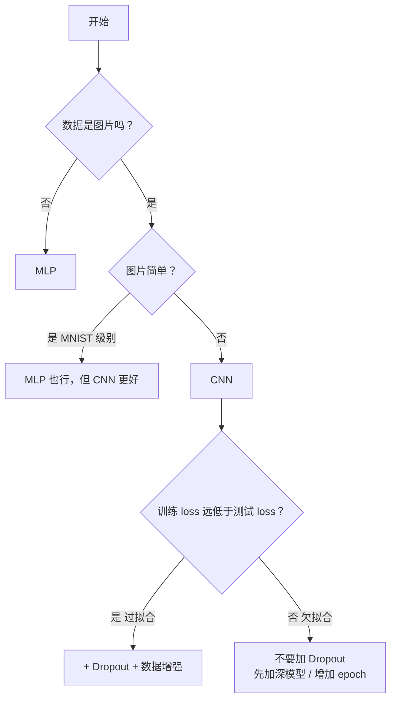

# 从 sklearn 到神经网络

以图像分类（MNIST / CIFAR-10）为主线，记录从传统机器学习迁移到神经网络的学习路径。

> **前置推荐**：如果还不清楚"神经网络到底是什么、为什么能学习"，先看 **3Blue1Brown 的 Neural Networks 系列**

---

## 0. 一切从逻辑回归开始

在进入神经网络前，先回顾传统机器学习中的逻辑回归模型。

### 逻辑回归 = 一个神经元

泰坦尼克数据集：7 个特征（年龄、性别、舱位…），预测死/活。

**numpy 手写版**：

```python
w = np.random.randn(7) * 0.01
b = 0

for step in range(2001):
    z = X @ w + b                           # X(N,7) @ w(7,) = z(N,)：把每行样本的七个特征映射成一个值
    pred = 1 / (1 + np.exp(-z))             # sigmoid：将所有实数压缩成一个(0,1)区间的值，在这里相当于概率了
    loss = -np.mean(y * np.log(pred + 1e-8) + (1-y) * np.log(1-pred + 1e-8)) # 交叉熵，算出loss

    dw = (1/len(X)) * X.T @ (pred - y)      # 手推梯度公式，找到最快降低loss的方向和大小
    db = np.mean(pred - y)
    w -= lr * dw                             # 往梯度反方向迈一步，同时更新参数
    b -= lr * db
```

**PyTorch 版**：

```python
model = nn.Linear(7, 1)                     # 里面就是 7 个 w + 1 个 b
loss_fn = nn.BCEWithLogitsLoss()            # sigmoid + 交叉熵二合一
optimizer = optim.SGD(model.parameters(), lr=0.01)

for step in range(2001):
    z = model(x_t).squeeze()                 # 前向计算
    loss = loss_fn(z, y_t)                   # 计算损失
    optimizer.zero_grad()                    # 梯度清零：防止累加
    loss.backward()                          # 反向传播：自动求梯度
    optimizer.step()                         # 更新参数：w -= lr*dw
```

两段代码做的是同一件事。
区别只有两个：梯度从"手推公式"变成了 `backward()`，参数更新从 `w -= lr*dw` 变成了 `optimizer.step()`。


### 一层 → 多层 → 神经网络

逻辑回归是 **7 个输入 → 1 个输出**，中间没有隐藏层。

神经网络的做法是：在输入和输出之间**多塞几层**，每层由很多个"逻辑回归"并排干活：

```
逻辑回归（单层）:    input(N,7)  →  输出1个z  →  sigmoid算概率  →  死/活

神经网络（多层）:    input(N,784) →  hidden₁(N,128) →  hidden₂(N,64) →  output(N,10)
                    ↑ 矩阵乘法      ↑ ReLU 消线性     ↑ ReLU            ↑ 10 个分数
```

**每一层本质上还是一个矩阵乘法 `y = x @ W^T + b`**，和逻辑回归一模一样。多出来的东西就两样：

1. **ReLU**——夹在层与层之间，就是这个运算：a=max(0,a)
2. **softmax / CrossEntropyLoss**——输出从 1 个分数变成 10 个分数，选最大的作为预测类别。

>因此，逻辑回归在数学上和神经网络完全等价，可以理解成是最简单的一种神经网络。

如果看不懂也问题不大，后面的章节就是把这个框架拆开，一个一个零件讲清楚。

---

## I. 深度学习完整流程

完整的深度学习分类项目，分六个阶段：

```
原始数据 → 加载 → 定义模型 → 训练循环 → 评估 →  保存
.png      分批    搭网络     五步走    打分   导出
```

**和 sklearn 最大的区别**：sklearn 的 `fit()` 是黑盒，PyTorch 的**训练循环必须自己写**。

### 1.1 数据加载（DataLoader）

sklearn 阶段，泰坦尼克 623 条数据一次全传 `model.fit(X, y)`，内存装得下。MNIST 有 60000 张图，一次全塞内存直接爆。`DataLoader` 解决的就是这件事——切成一个个 batch，每次只喂一小撮。

整个流水线：

```
datasets.MNIST → transforms.ToTensor → DataLoader
  拿原始数据        像素 0~255 → 0~1      分批次（每包 64 张）
```

| 操作 | 函数 | 作用 |
|------|------|------|
| 下载数据集 | `datasets.MNIST(root, train=True, download=True)` | 数据从哪来 |
| 转成 Tensor | `transforms.ToTensor()` | 像素缩放到 0~1，转 PyTorch 格式 |
| 分批加载 | `DataLoader(dataset, batch_size=64, shuffle=True)` | 每次喂多少张，打不打乱 |

两个数据集规模：

| | 训练集 | 测试集 | 图片尺寸 | 类别 |
|------|--------|--------|---------|------|
| MNIST | 60,000 | 10,000 | 28×28 灰度 | 0~9 数字 |
| CIFAR-10 | 50,000 | 10,000 | 32×32 彩色 | 飞机/汽车/鸟/猫/鹿/狗/青蛙/马/船/卡车 |

**`batch_size` 怎么选**：太小（8）→ 梯度噪音大，训练不稳定。太大（512）→ 显存放不下。32/64/128 是常见值，CPU 训练用 64。

**`shuffle` 为什么重要**：训练集必须打乱——否则模型会记住数据排列顺序（按标签 0→1→2→…），学到的是"0 后面就是 1"而不是"数字长什么样"。测试集不需要打乱。

**epoch vs batch**：epoch = 整个数据集完整过了一遍；batch = 每次取一小撮；10 个 epoch = 过了 10 遍，每遍切成若干包。

### 1.2 定义模型

搭出"输入 → 中间层 → 输出"的计算结构：

```
MLP（表格数据 / 简单图片）：
  Flatten → Linear → ReLU → Linear → ReLU → Linear → 输出

CNN（图片数据）：
  Conv2d → ReLU → MaxPool → Conv2d → ReLU → MaxPool → Flatten → Linear → 输出
```

**Linear vs Conv2d 的本质差异**：

| | Linear（全连接） | Conv2d（卷积） |
|---|---|---|
| 看什么 | 看全部输入，每个输出和所有输入相连 | 只看一个 3×3 小窗口 |
| 图片怎么处理 | 先 Flatten 拉成一维，丢失空间信息 | 保留二维结构，窗口在图上滑动 |
| 参数量 | 很大（784×128=100352） | 很小（3×3=9，权重共享） |
| 什么时候用 | 表格数据、分类头 | 图片、视频等有空间结构的数据 |

**ReLU 为什么不能省**：`Linear → Linear` 数学上等价于一个更大的 `Linear`（矩阵乘法满足结合律）。ReLU 把负数清零，打破了线性关系，多层才有了意义。

### 1.3 训练循环

让模型一轮一轮地学——猜答案 → 看差多少 → 算该往哪调 → 调一下 → 重复。

```
for epoch in range(10):
    for images, labels in train_loader:
        optimizer.zero_grad()              # 1.清空上一轮的梯度
        outputs = model(images)            # 2.前向传播——猜答案
        loss = loss_fn(outputs, labels)    # 3.算 loss——看差多少
        loss.backward()                    # 4.反向传播——算每个参数该调多少
        optimizer.step()                   # 5.更新参数——真的去调
```

这五步的顺序绝对不可乱。这等价于 sklearn `fit()` 内部在做的事——区别只是 sklearn 封装好了，PyTorch 让你亲手写。

| 步骤 | 做了什么 | 忘了会怎样 |
|------|---------|-----------|
| ① zero_grad | 把上一轮的梯度擦掉 | 梯度越滚越大，loss 不降 |
| ② forward | 用当前的 w 和 b 算预测值 | — |
| ③ loss | 比较预测值和真实答案 | — |
| ④ backward | 从 loss 往回算，算出每个参数该往哪调 | 参数不会更新 |
| ⑤ step | `w -= lr × w.grad`，真的调参数 | 模型不学习 |

**为什么 PyTorch 需要 zero_grad 而 numpy 不需要**：PyTorch 的 `.grad` 默认**累加**（`+=`），这是为了支持 RNN 等需要跨时间步累加梯度的场景。numpy 里每次 `dw = ...` 是赋值覆盖，不需要清。

**三行对比，本质一目了然**：

```python
# sklearn —— 一行黑盒
model.fit(X_train, y_train)

# numpy 手写 —— 每一行都透明
z = X @ w + b
pred = 1/(1+np.exp(-z))
loss = -np.mean(y*log(pred) + (1-y)*log(1-pred))
dw = (1/n)*X.T @ (pred - y)
w -= lr * dw

# PyTorch —— numpy 的自动化版本
outputs = model(images)
loss = loss_fn(outputs, labels)
loss.backward()            # 替代手写的 dw/db
optimizer.step()           # 替代 w -= lr*dw
```

### 1.4 模型评估

看模型在没见过的数据上表现如何：

```python
model.eval()                          # 切到测试模式
with torch.no_grad():                 # 关掉梯度记录，省内存
    for images, labels in test_loader:
        outputs = model(images)
        _, predicted = torch.max(outputs, 1)   # 10 个分数取最大的
        correct += (predicted == labels).sum()
```

**`model.train()` 和 `model.eval()` 是成对的**——训练前调 `train()`，评估前调 `eval()`。
Dropout 和 BatchNorm 在两种模式下行为不同：训练时 Dropout 随机关神经元，测试时全部在用。忘切换会导致评估结果不准。

**`torch.no_grad()` 为什么需要**：评估时不需要求导，但 PyTorch 默认搭计算图（给 backward 指路的）。关掉它省内存、速度快。

**二分类 vs 多分类的取结果方式**：

```
二分类（泰坦尼克）: pred = (torch.sigmoid(z) >= 0.5).float()
多分类（MNIST）:    _, predicted = torch.max(outputs, 1)   # 10 个分数取最高
```

### 1.5 模型保存 / 加载

```python
# 保存——只存参数（w 和 b 的值）
torch.save(model.state_dict(), 'model.pth')

# 加载——必须先搭一个结构相同的空壳
model = 同样的模型结构()
model.load_state_dict(torch.load('model.pth'))
```

**和 sklearn 的关键区别**：`joblib.dump` 把结构和参数一起打包；`torch.save` 只保存参数，结构需要自己记住。因为模型结构是 Python 代码不是数据，存代码不安全（版本兼容性），存参数干净且小。

---

## II. 核心组件

本节把每个组件拆开，讲清楚**底层在算什么、和 numpy/sklearn 怎么对应**。

### 2.1 数据加载

MNIST 数据加载代码：

```python
transform = transforms.ToTensor()
train_data = datasets.MNIST(root=DATA_DIR, train=True, download=True, transform=transform)
test_data  = datasets.MNIST(root=DATA_DIR, train=False, download=True, transform=transform)
train_loader = DataLoader(train_data, batch_size=64, shuffle=True)
test_loader  = DataLoader(test_data, batch_size=64, shuffle=False)
```

#### 2.1.1 `datasets.MNIST()` / `datasets.CIFAR10()`

```python
from torchvision import datasets, transforms

train_data = datasets.MNIST(
    root='data',                          # 下载到哪（建议用绝对路径）
    train=True,                           # True=训练集，False=测试集
    download=True,                        # 第一次运行下载，之后跳过
    transform=transforms.ToTensor()       # 对每张图做什么变换
)
```

返回一个 `Dataset` 对象，`train_data[0]` → `(图片_tensor, 标签)`。
CIFAR10 写法完全一样，把 `MNIST` 换成 `CIFAR10` 即可。

#### 2.1.2 `DataLoader()`

```python
train_loader = DataLoader(train_data, batch_size=64, shuffle=True)
```

`for images, labels in train_loader` 每次吐出一个 batch：

```python
images.shape  # (64, 通道, 高, 宽)    MNIST: (64, 1, 28, 28)
labels.shape  # (64,)                 每张图对应的数字 0~9
```

**参数要点**：`shuffle=True` 训练时打乱，测试时不打乱；`num_workers=0`（主线程）对 MNIST/CIFAR-10 够用，大图才需要多进程；`pin_memory=True` 只在 GPU 训练时有用。


#### 2.1.3 `transforms.Compose()` — 数据增强

```python
train_transform = transforms.Compose([
    transforms.RandomHorizontalFlip(),              # 随机水平翻转
    transforms.RandomRotation(10),                  # 随机旋转 ±10°
    transforms.ToTensor(),
])
```

**数据增强只在训练集上用**——原理和 sklearn 的"测试集不能用 fit_transform"一样：考试时题目不能改。返回一个函数对象，每张图加载时自动执行。


### 2.2 网络层

CNN 模型定义：

```python
model = nn.Sequential(
    nn.Conv2d(1, 16, kernel_size=3, padding=1),   # 1→16 通道
    nn.ReLU(),
    nn.MaxPool2d(2),                               # 28×28 → 14×14
    nn.Conv2d(16, 32, kernel_size=3, padding=1),   # 16→32 通道
    nn.ReLU(),
    nn.MaxPool2d(2),                               # 14×14 → 7×7
    nn.Flatten(),                                  # [batch, 32, 7, 7] → [batch, 1568]
    nn.Linear(1568, 128),
    nn.ReLU(),
    nn.Linear(128, 10),
 ).to(device)
```

每个层本质上都是**对输入张量做一次数学运算**。
**参数（w 和 b）存在层内部，`model.parameters()` 把它们全部暴露给优化器。**

#### 2.2.1 `nn.Linear(in_features, out_features)` — 全连接层

**底层运算**：

```
输入 x: (batch, in_features)   @   W.T: (in_features, out_features)    +    偏置 b: (out_features,)
                                            ↓
                                  输出 y: (batch, out_features)
```

即 `z = X @ W.T + b`。和 numpy 手写逻辑回归的 `z = X @ w + b` 是**同一件事**——区别只是 w 从向量 `(7,)` 变成了矩阵，因为输出从 1 个数变成了 out_features 个数。

> **关于 `W.T`**：`nn.Linear(in_features, out_features)` 内部存的权重 shape 是 `(out_features, in_features)`。
> 前向传播时做 `input @ weight.T + bias`，即 `(batch, in) @ (in, out) + (out,)`。之所以存转置形式，是底层的历史问题——理解成 `in → out` 即可^^。

**一个 `nn.Linear(784, 128)` 就是 128 个逻辑回归并排干活**，每个输出神经元和全部 784 个输入相连，各有自己的 784 个权重 + 1 个偏置。参数量 = 784×128 + 128 = 100,480。


```python
# MNIST MLP 的三层 Linear
nn.Linear(784, 128)    # 输入: (batch, 784) → 输出: (batch, 128)
nn.Linear(128, 64)     # 输入: (batch, 128) → 输出: (batch, 64)
nn.Linear(64, 10)      # 输入: (batch, 64)  → 输出: (batch, 10)（10 个类别分数）
```


#### 2.2.2 `nn.ReLU()` — 激活函数

**原理**：`ReLU(x) = max(0, x)`

```python
ReLU([-3, -1, 0, 2, 5]) = [0, 0, 0, 2, 5]
```

**为什么必须夹在层与层之间**：
两个 Linear 中间不夹任何东西，`Linear₁ → Linear₂` 数学上 = 一个更大的 `Linear`。
因为 `(x @ W₁^T) @ W₂^T = x @ (W₁^T @ W₂^T)`，矩阵乘法满足结合律，堆一百层也只等于一层。

`ReLU` 不是线性的（没法用矩阵乘法实现"负数清零"），使用它可以给全连接层引入非线性，增加拟合能力。
所以 `Linear → ReLU → Linear` 无法被合并——每层真的在学不同的东西。
激活函数还有 Sigmoid、Tanh、GELU 等变体，但 ReLU 相对好理解。


#### 2.2.3 `nn.Conv2d(in_channels, out_channels, kernel_size, padding)` — 卷积层

**底层运算**：和 Linear 的全局矩阵乘法不同，卷积是一个 3×3 小窗口在图片上**滑动**，每个位置做一次局部点积。

```
输入: (batch, in_channels, H, W)
  ↓  用 out_channels 个 3×3×in_channels 的卷积核在图上滑动
输出: (batch, out_channels, H', W')
```

**和 Linear 的本质区别**：Linear 看全局（每个输出连接所有输入），Conv2d 看局部（每个输出只看一个 3×3 窗口）。图像上"相邻像素才有关系"——卷积把这条先验知识编码进了模型结构。这就是为什么 CNN 在图片上碾压 MLP。

**参数量为什么极小**：`Conv2d(1→16, 3×3)` = 1×16×9 + 16 = **160 个参数**。对比 `Linear(784→128)` 的 100,352 个。卷积靠**权重共享**——同一个 3×3 窗口在整张图上滑动，不管图多大，参数只和窗口有关。

**`padding=1` 干什么**：不做 padding，3×3 卷积后图片会小一圈（28×28 → 26×26）。padding=1 在图片外围补一圈零，输出尺寸和输入一样大，方便堆叠多层。

```python
# MNIST: 灰度图（1 通道）
nn.Conv2d(1, 16, kernel_size=3, padding=1)    # (batch, 1, 28, 28) → (batch, 16, 28, 28)

# CIFAR-10: 彩色图（3 通道 RGB）
nn.Conv2d(3, 16, kernel_size=3, padding=1)    # (batch, 3, 32, 32) → (batch, 16, 32, 32)
```


#### 2.2.4 `nn.MaxPool2d(kernel_size)` — 最大池化

**做的事**：在 2×2 格子里取最大值，压成一个。`stride` 默认等于 `kernel_size`，窗口不重叠。

```
[3, 7]
[1, 5]   →  7
```

**为什么需要**：卷积层只提取特征不缩小尺寸，一直不缩的话计算量会爆炸。Pooling 负责缩小——28×28 → 14×14 → 7×7，每步面积缩到 1/4，也让下一层卷积看到更大范围。


#### 2.2.5 `nn.Flatten()` — 拉直

**做的事**：把卷积输出的三维特征图（通道×高×宽）拉成一维向量，才能喂给 Linear。

```python
输入:  (batch, 32, 7, 7)      # batch × 32 通道 × 7×7 特征
输出:  (batch, 1568)           # batch × 1568 ：1568 个数字排成batch行
```

`start_dim=1` 意味着不碰 batch 维度——保留样本数目，64 张图还是 64 张，只把后面的维度拉直。
**只在即将开始 Linear 处用一次。**

#### 2.2.6 `nn.Dropout(p)` — 随机关闭神经元

**做的事**：每轮训练随机关掉 p 比例的神经元，被关的人这轮"休息"。其他人被迫顶上去，逼出冗余的判断能力。

**训练 vs 测试**：训练时随机关（制造压力），测试时全部在用（要稳定结果）。这两个模式由 `model.train()` 和 `model.eval()` 自动切换。

**不是随便用**：实际项目中，CIFAR-10 CNN 加了 Dropout 后准确率从 53.20% **掉到** 49.99%。原因是两层 CNN 远没到过拟合——还在学基础，关神经元等于削弱。


### 2.3 损失函数

多分类任务中损失函数：

```python
loss_fn = nn.CrossEntropyLoss()

# 训练循环中：
outputs = model(images)
loss = loss_fn(outputs, labels)    # 10 个分数 vs 正确数字，算出差多少
loss.backward()
```

损失函数回答一个问题：**模型猜的答案和真实答案差多少？** 差得多就罚重一点，反向传播时梯度大，参数调得猛；差得少就轻罚。

但它不能直接比较。模型输出的是一堆原始分数（z），有时候正有时候负，跟"概率"不是一回事。**对于分类任务来说**，损失函数内部做了两件事：**分数→概率→loss**。

#### 第一步：分数变概率

**二分类**——sigmoid。输入 1 个实数，输出 1 个 (0,1) 之间的概率：

```
z = 5.0  →  sigmoid(5.0) = 0.993   # 大概率是 1
z = 0.0  →  sigmoid(0.0) = 0.500   # 完全不确定
z = -3.0 →  sigmoid(-3.0) = 0.047  # 大概率是 0
```

**多分类**——softmax。输入 N 个实数，输出 N 个概率，**加起来等于 1**：

假设模型对一张"7"的图片输出了 10 个分数
```
z = [0.2, 0.1, 0.5, 0.3, 1.2, 0.8, 2.0, 5.0, 0.4, 0.6]
softmax(z) →
  [0.006, 0.005, 0.008, 0.006, 0.016, 0.011, 0.036, 0.902, 0.008, 0.008]
                                                     ↑ 数字 7 ：概率 90.2%
```

sigmoid 和 softmax 是两个相关的函数——二分类时 softmax 退化成 sigmoid（两个概率相互制约，知道一个就知另一个）。所以理论上二分类也能用 softmax，只是多此一举。

#### 第二步：概率变 loss（交叉熵，Cross-Entropy）

变成概率之后，怎么用一个数字衡量"猜得有错"？

直觉：正确答案的那个位置，我想要它的概率**越高越好**。那就对它取个 `-log`——因为 -log 的曲线天然满足这个需求：

```
概率 = 0.9  →  -log(0.9) = 0.105    （猜得不错，轻轻罚一下）
概率 = 0.5  →  -log(0.5) = 0.693    （一半一半，差不多罚一下）
概率 = 0.01 →  -log(0.01) = 4.605   （错到离谱，往死里罚）
```

-log(1) = 0（完美预测，零惩罚），而概率越小 -log 增长越猛——这就是交叉熵的核心：**放大自信犯错**。模型越笃信错误答案，惩罚越重。

所以整个损失函数做的事，就是：

```
原始分数 → sigmoid/softmax → 概率 → -log(正确类别的概率) → 所有样本取平均
```

用一个数字概括了"模型整体上有多错"。这个数字越小越好。loss = 2.3 说明模型平均信心不足；loss = 0.05 说明基本全对。

#### 为什么不手动分两步做

```python
# 先 sigmoid 再算交叉熵
p = torch.sigmoid(z)
loss = -(y * torch.log(p) + (1-y) * torch.log(1-p)).mean()

# 但不建议。因为 torch.log(p) 在 p≈0 时会炸（log(0) = -inf）
```

所以 `BCEWithLogitsLoss` 和 `CrossEntropyLoss` 把两步合在一起，传原始分数就行，不用手动 sigmoid/softmax。

#### 两个损失函数的对比

| | BCEWithLogitsLoss | CrossEntropyLoss |
|---|---|---|
| 用在 | 二分类 | 多分类（3 类及以上） |
| 分数→概率 | sigmoid | softmax |
| 标签格式 | 0.0 或 1.0（float） | 0, 1, 2...（long，类别编号） |
| 示例 | 泰坦尼克（二分类） | MNIST, CIFAR-10（多分类） |

**为什么不能互换**：MNIST 模型输出的是 `(batch, 10)`，10 个分数。CrossEntropyLoss 期望的就是 10 个分数，内部 softmax + 交叉熵。
BCEWithLogitsLoss 期望的是 1 个分数。如果硬把 10 个分数传给 BCE，语义就不对了——除非手动拆成 10 个独立的二分类任务，但那是自找麻烦。


### 2.4 优化器与调度器

训练循环中用法：

```python
optimizer = optim.SGD(model.parameters(), lr=0.01)
scheduler = optim.lr_scheduler.StepLR(optimizer, step_size=5, gamma=0.5)  # 可选
# 训练循环中：
optimizer.zero_grad()     # 清梯度
outputs = model(images)   # 前向
loss = loss_fn(...)       # 算 loss
loss.backward()           # 反向
optimizer.step()          # 更新参数
scheduler.step()          # 调整学习率（每个 epoch 调一次）
```

#### 2.4.0 `loss.backward()` — 自动求梯度

```python
# numpy —— 手动推导梯度公式，手动写代码
dw = (1/n) * X.T @ (pred - y)
db = np.mean(pred - y)

# PyTorch —— 顺着计算图自动算
loss.backward()   # 跑完这一行，w.grad 和 b.grad 已经填好了
```

`forward` 时 PyTorch 在后台搭了计算图（记录每一步运算），`backward()` 沿着图反向走一遍，用链式法则自动算出每个参数的梯度。
**只算不调**——算完存在 `w.grad` 里，下一步 `optimizer.step()` 才去用。

优化器和调度器是两个独立的组件：
- **优化器**（SGD、Adam 等）——必选。负责 `step()`，即真的去调参数 `w -= lr × w.grad`。没有它模型不会学习。
- **调度器**（StepLR 等）——可选。负责在 epoch 层面调整优化器的 lr（如每 5 个 epoch 减半）。没有它模型照样收敛，只是收敛速度可能不是最优。

```
backward()  →  算出 w.grad（方向）
step()      →  w -= lr × w.grad（迈步子）   ← 优化器
scheduler.step() →  调整 lr（步子越迈越小）  ← 调度器
```

在 epoch 循环里的位置：

```python
for epoch in range(epochs):
    train_one_epoch(...)     # 内部多次调用 optimizer.step()
    scheduler.step()         # epoch 结束后调一次（调整 lr）
```

#### 2.4.1 `optim.SGD(model.parameters(), lr)` — 随机梯度下降

**做的事**：`w -= lr × w.grad`。就是 `w -= lr * dw`的自动化。

```python
optimizer = optim.SGD(model.parameters(), lr=0.01)
```

`model.parameters()` 返回模型所有层的 w 和 b，优化器靠这个列表知道"我该管哪些数字"。`backward()` 算出梯度，`step()` 真的去调——这两个必须成对出现，一个算方向，一个迈步子。

**lr 怎么选**：太大 → 冲过头，loss 震荡不收敛；太小 → 学太慢。
0.01 是安全的默认值。还有 Adam 等变体（自动调步长），先用 SGD 理解本质。


#### 2.4.2 `lr_scheduler.StepLR` — 调度器（可选）

```python
scheduler = optim.lr_scheduler.StepLR(optimizer, step_size=5, gamma=0.5)
# epoch 1-5: lr=0.01  →  epoch 6-10: lr=0.005  →  epoch 11-15: lr=0.0025
```

本意是"前期大步快跑、后期小步精调"。10 个 epoch 的小实验不需要，epoch 多（30+）且模型大时才考虑。


### 2.5 常用工具

杂项函数，不在前面的分类里但到处都在用。

#### 2.5.1 `model.train()` / `model.eval()` — 切换训练/测试模式

```python
model.train()   # 告诉模型：现在是训练
model.eval()    # 告诉模型：现在是考试
```

大部分层在这两种模式下行为一样。只有两个例外：

- **Dropout** — `train()` 时随机关神经元（制造压力），`eval()` 时全部打开（要稳定结果）
- **BatchNorm** — `train()` 时用当前 batch 的统计量，`eval()` 时用训练阶段攒下来的全局均值方差

所以忘写 `eval()` 不只是一种"规范上的错误"——Dropout 开着的话测试结果会偏低且不稳定，BatchNorm 的统计量也会跑偏。**训练前 `train()`，评估前 `eval()`，养成习惯。**

#### 2.5.2 `torch.max()`

```python
_, predicted = torch.max(outputs, 1)    # dim=1 沿类别方向取最大
```

`outputs` 形状 `(batch, 10)`，`dim=0` 是 batch 方向，`dim=1` 是类别方向。
需要的是"每个样本的 10 个分数里哪个最大"，所以 `dim=1`。
返回 `(最大值, 位置)` 元组，`_` 接收最大值本身（不重要），`predicted` 是位置 = 类别编号 0~9。

#### 2.5.3 `loss.item()` — tensor → Python 数字

```python
train_loss += loss.item()
```

`loss` 是 PyTorch tensor，后面挂着计算图（给 backward 指路的）。
`.item()` 把它变成普通 Python float，**切断计算图，释放内存**。几万个 batch 的 loss 如果不 `.item()`，计算图会越攒越大直到爆内存。

#### 2.5.4 `model.parameters()` — 暴露所有参数

```python
optimizer = optim.SGD(model.parameters(), lr=0.01)
```

返回一个生成器，遍历模型所有层的 w 和 b。优化器靠这个列表知道"我该管哪些数字"。
模型搬到 GPU 后（`model.to(device)`），`parameters()` 返回的参数也自动在 GPU 上。

---

## III. MLP vs CNN 对比

### 3.1 模型总览

| 维度 | MLP | CNN | CNN + 优化 |
|------|-----|-----|-----------|
| **类型** | 全连接网络 | 卷积神经网络 | CNN + 防过拟合 |
| **适用场景** | 表格数据、简单图片 | **图片** | 复杂图片、数据不足时 |
| **怎么看数据** | Flatten 拉直，丢掉空间信息 | 3×3 窗口滑动，保留二维结构 | 同 CNN |
| **参数量** | ~10.9 万 | ~20.7 万 | ~20.7 万 |
| **训练速度** | 快 | 中 | 慢（数据增强实时算） |
| **MNIST 准确率** | 93.74% | 97.90% | 97.26% |
| **CIFAR-10 准确率** | 41.18% | 53.20% | 49.99% |

> 参数量计算：
> MLP: `Linear(784→128)` = 784×128+128 = 100,480；`Linear(128→64)` = 128×64+64 = 8,256；`Linear(64→10)` = 64×10+10 = 650。合计 ≈ 10.9 万。
> CNN: `Conv2d(1→16,3×3)` = 1×16×9+16 = 160；`Conv2d(16→32,3×3)` = 16×32×9+32 = 4,640；`Linear(1568→128)` = 1568×128+128 = **200,832**；`Linear(128→10)` = 128×10+10 = 1,290。合计 ≈ 20.7 万。
> CNN 的参数**绝大多数在分类头**（最后的 Linear），卷积层参数极少——因为权重共享。

### 3.2 为什么 CNN 在图像上比 MLP 强那么多？

**MLP 的致命缺陷**：第一步就把图片 Flatten 拉直了。一个数字"7"的左上角像素和右下角像素被当成两个无关的数字——CNN 知道它们相邻，MLP 不知道。

```python
# MLP 看到：
[0.0, 0.0, 0.0, 0.5, 0.9, 0.5, 0.0, ...]  # 784 个毫无空间关系的数字

# CNN 看到：
┌──────────┐
│ 0  0  0  │  # 左边空白
│ 0  5  9  │  # 中间有一笔 → 这可能是数字！
│ 0  5  0  │
└──────────┘
```

CIFAR-10 上差距更大（41.18% → 53.20%，+12%）——因为真实物体的局部特征（飞机翅膀、猫耳朵、车轮子）CNN 的 3×3 窗口能捕捉，MLP 的全局 Linear 不行。

### 3.3 为什么优化版反而更差？

这不是 bug，是**模型容量和优化技巧不匹配**

- **数据增强** → 题目变难了，模型还在学基础，突然加难度反而困惑
- **Dropout** → 两层 CNN 总共才 20 万参数，还没到"背题目"的过拟合程度，关神经元等于削弱自己
- **学习率调度** → 提前减速，10~15 个 epoch 远未收敛，还没到山下就放慢了脚步

**核心判断**：

| 状态 | 诊断 | 该做什么 |
|------|------|---------|
| 训练 loss 高、测试 acc 低 | 欠拟合 | 加深模型、增加 epoch，**不要加 Dropout/增强** |
| 训练 loss 低、测试 acc 明显更低 | 过拟合 | **这时候**才用 Dropout + 数据增强 + 学习率调度 |

这和 sklearn 中决策树 `max_depth` 的选择是同一个道理：`max_depth=1`（欠拟合）→ `max_depth=5`（刚好）→ `max_depth=None`（过拟合）→ 过拟合时限制深度。

### 3.4 模型选择



| 场景 | 选什么 |
|------|--------|
| 表格数据（年龄、性别、舱位…） | MLP |
| 灰度数字、简单分类 | MLP 或 CNN（CNN 更好但 MLP 也够用） |
| 真实物体图片（飞机/猫/车…） | **CNN**（MLP 完全不行） |
| 模型过拟合 | + Dropout + 数据增强 |
| 不确定用哪个 | 全跑一遍，看测试准确率决定 |

---

## IV. PyTorch / sklearn 对比

| | sklearn | PyTorch |
|---|---|---|
| **训练** | `model.fit(X, y)` 一行 | 五步手写 for 循环 |
| **预测** | `model.predict(X)` | `model(x)` + `torch.max` |
| **评估** | `model.score(X, y)` | **手写 `pred == labels` 统计** |
| **调参** | **GridSearchCV 自动搜索** | **手动改网络结构、手动记录结果** |
| **模型保存** | `joblib.dump/load`（结构和参数一起打包） | `torch.save + load_state_dict`（只存参数） |
| **过拟合判断** | 比较 train/test 准确率 | **画 loss/acc 曲线**，看两条线是否分叉 |
| **底层可见度** | 黑盒——不知道 fit 里面在干嘛 | 白盒——每一行都知道在做什么 |
| **随机种子** | 每个函数自带 `random_state` | 需手动固定三个随机源（Python、PyTorch、cuDNN） |
| **调试方式** | GridSearchCV 暴力穷举最优参数 | **看 loss 曲线**——不降说明 lr 有问题，train/test 分叉说明过拟合 |

---

## V. 常见坑和排错清单

| 坑 | 现象 | 原因 | 解决 |
|----|------|------|------|
| 忘写 zero_grad | loss 震荡不降 | 梯度累加，越滚越大 | 在 backward 前加 `optimizer.zero_grad()` |
| 测试集忘设 eval | 测试准确率不对 | Dropout/BatchNorm 行为未切换 | 评估前 `model.eval()`，训练前 `model.train()` |
| 忘写 no_grad | 显存溢出（大数据时） | 计算图在后台攒着 | 评估时加 `with torch.no_grad()` |
| 路径用相对路径 | 数据找不到或下到别处 | root 相对路径从不同目录运行会错 | 用 `os.path.dirname(__file__)` 拼绝对路径 |
| batch_size 太大 | OOM / 内存溢出 | 显存放不下 | 调小到 32 或 16 |
| loss 不下降 | 模型完全不学习 | lr 太大/太小、数据有问题 | 先在 200 条数据上做过拟合测试 |
| 优化后分数更低 | 加 Dropout/增强后准确率降 | 模型还在欠拟合 | 先去 Dropout、加深模型、增加 epoch |
| 二分类用了 CrossEntropyLoss | 报错或 loss 异常 | CrossEntropy 期望标签是整数 0~C-1 | 二分类用 BCEWithLogitsLoss |
| Flatten 后 Linear 输入数不对 | shape mismatch | 忘了计算卷积输出尺寸 | 手动算或用 `print(model(x).shape)` 验证 |
| 训练/测试准确率差距大 | 过拟合 | 模型太强 / 数据太少 | 加 Dropout、数据增强、减小模型 |
| GPU 不工作 | 任务管理器里 GPU 没动 | 数据和模型没搬上 GPU | 模型 + 每批数据都要 `.to(device)` |
| 每次跑结果不一样 | 三次跑三个不同分数 | PyTorch 默认不固定随机种子 | 调用 `set_seed(42)`（固定 Python、PyTorch、cuDNN 三个随机源） |
| `model.eval()` 后代码跑得更快 | 正常现象 | `eval()` 关闭了 Dropout 等操作 | 不是 bug，评估就应该是这个速度 |
