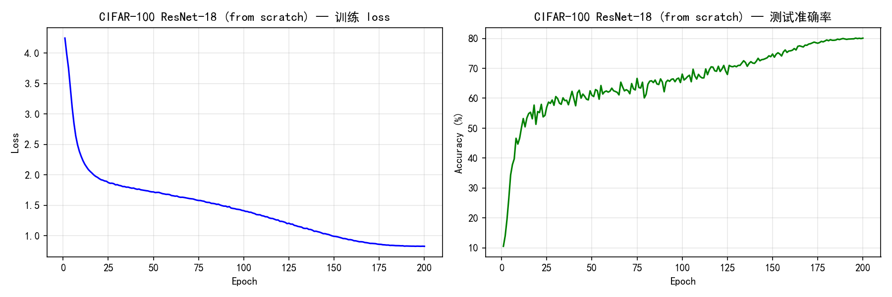
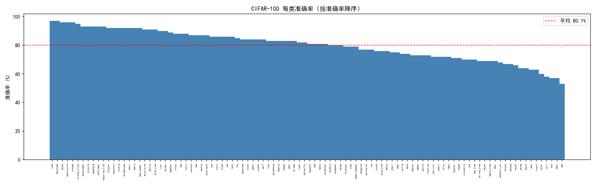
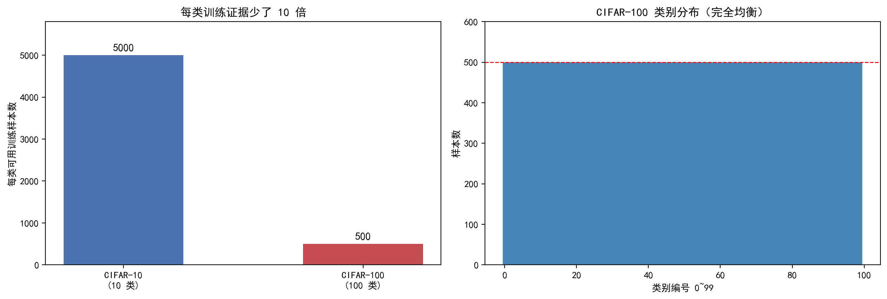
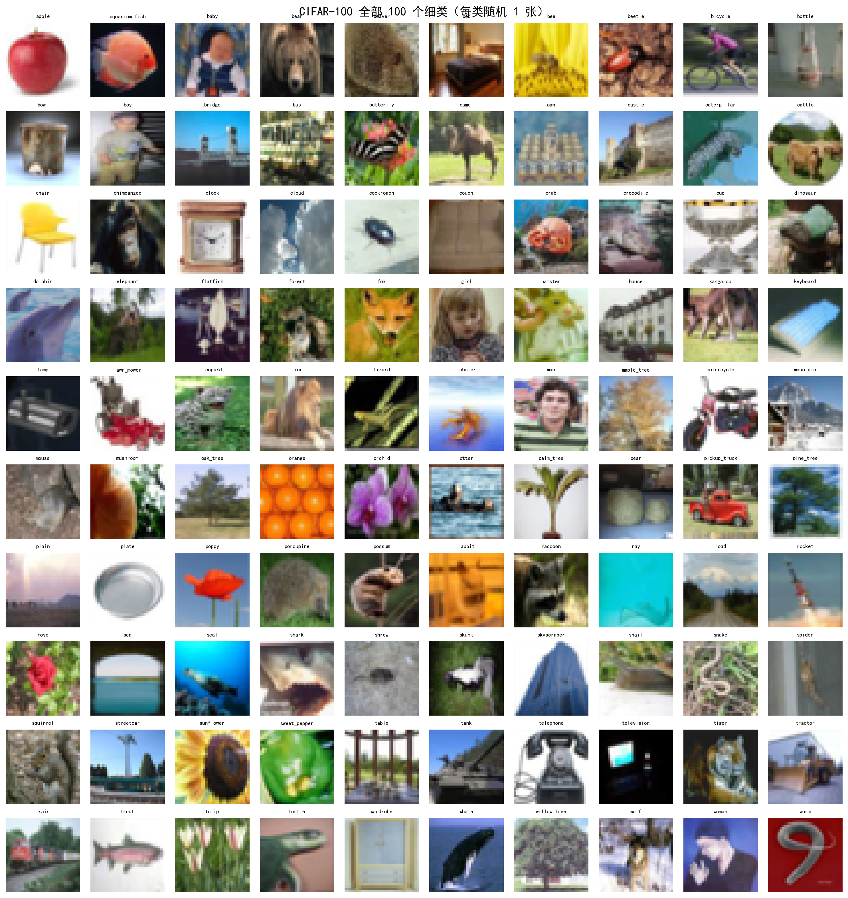
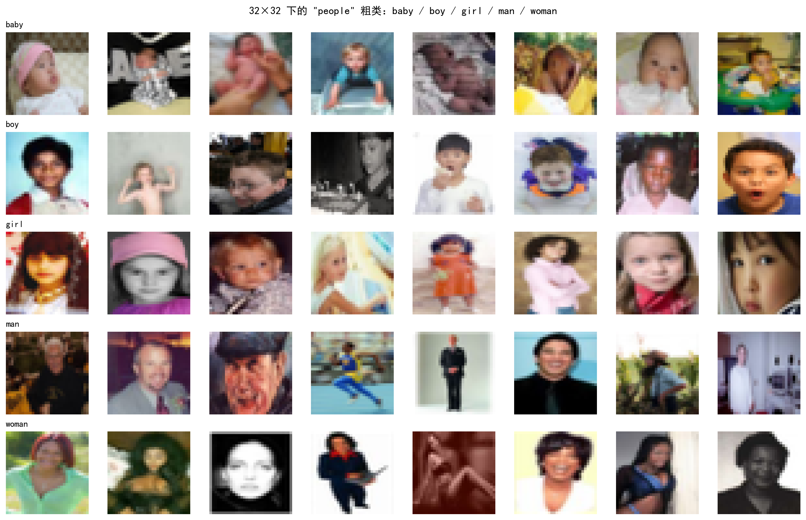

# CIFAR-100 · ResNet-18 从零训练

在 CIFAR-100 上**从随机初始化**训练 ResNet-18（不使用任何预训练权重），
建立一个可复现的基线，并搞清"从零训练"和"预训练微调"到底差在哪。

## 项目定位

> **在 CIFAR-100 上的一个从零训练基线。**

| 价值 | 内容 |
|---|---|
| 练流程 | 亲手处理数据增强、正则化、学习率调度、断点续训——小规模 CNN 项目碰不到这些坑 |
| 建立锚点 | 以后所有 CIFAR-100 实验（微调、改增强、换网络）都拿这个数字当起点 |
| 理解难度 | 和 CIFAR-10 的结果对照，看"同一个网络、数据变难"会掉多少分（注意：数据集不同，不是严格对照） |

## 数据集：CIFAR-100 和 CIFAR-10 差在哪

| | CIFAR-10 | CIFAR-100 |
|---|---|---|
| 总图片 | 60,000 | 60,000 |
| 尺寸 | 32×32 彩色 | 32×32 彩色 |
| 类别数 | 10 | **100** |
| 每类训练样本 | 5,000 | **500** |
| 随机猜 | 10% | **1%** |

**总数完全一样，区别只在怎么分摊**：CIFAR-100 每个类的训练证据只有 CIFAR-10 的 **1/10**。
模型要学的东西多了 10 倍，每类的证据少了 10 倍——难度是两头同时收紧的。

另外 CIFAR-100 还有层级结构：100 个细类（fine）可以归成 20 个粗类（superclass），每个粗类下 5 个细类。
数据集自带 `fine_labels` 和 `coarse_labels` 两套标签。跑 `src/explore_data.py` 会打印完整的对应表。

> ⚠ 粗类在编号上**不连续**：粗类 0 的成员编号是 `4/30/55/72/95`。
> 不能用 `fine_label // 5` 推算粗类，必须查表。

## 项目结构

```
ResNet-18-cifar-100/
├── data/                              # CIFAR-100（手动放置，约 161MB，已 gitignore）
├── src/
│   ├── explore_data.py                # 数据探索：类别分布 / 粗类对应表 / 100 类总览 / 易混淆类别
│   └── train.py                       # 主训练脚本（自包含，单文件）
├── models/
│   ├── resnet18_cifar100_best.pth     # 最佳权重
│   └── checkpoint.pth                 # 断点续训用（含优化器和调度器状态）
├── images/                            # 训练曲线、每类准确率、数据探索图
├── logs/train_log.csv                 # 逐 epoch 日志
├── README.md
└── requirements.txt
```

## 运行方法

```bash
pip install -r requirements.txt

# 第一步：准备数据（手动放置，一次性）。见下面「数据准备」一节
#   放好后用这条命令验证是否到位（几秒钟）
python -c "from torchvision import datasets; d=datasets.CIFAR100(root='data',train=True,download=False); print(len(d), d.classes[0])"

# 第二步：先看数据（约 1 分钟）
python src/explore_data.py

# 第三步：冒烟测试——全量数据只跑 3 轮，约 1 分钟
python src/train.py --epochs 3

# 第四步：完整训练，200 epoch（★ 实测不到 50 分钟，≈15 秒/epoch）
python src/train.py

# 中途断了就续训
python src/train.py --resume
```

> 图默认只存盘、不弹窗。想训练结束后看窗口就加 `--show`——
> `plt.show()` 会一直阻塞到窗口被关闭，长训练卡在那里等人点关闭不是好体验。

**冒烟测试要看的只有三件事**：数据能读、显存不炸、准确率明显高于 1%（100 类的随机水平）。
三条都过再启动完整训练。

> 冒烟测试不需要单独的"小数据模式"——实测一个完整 epoch 只要 **≈15 秒**，
> 所以 `--epochs 3` 在**全量数据**上跑本身就是约 45 秒的冒烟测试。

## 数据准备

数据**手动放一次**即可，不需要写下载代码。

**最终目录必须是这个结构**（`cifar-100-python` 这个目录名是 torchvision 里写死的）：

```
data/
└── cifar-100-python/
    ├── train
    ├── test
    └── meta
```

| 项 | 值 |
|---|---|
| 新官方地址 | `https://cave.cs.toronto.edu/kriz/cifar-100-python.tar.gz` |
| 旧地址（torchvision 里硬编码的就是它） | `https://www.cs.toronto.edu/~kriz/cifar-100-python.tar.gz` |
| 压缩包 md5 | `eb9058c3a382ffc7106e4002c42a8d85` |

**验证是否到位**（`download=False` 逼它只从磁盘读，能读出来就说明没问题）：

```bash
python -c "from torchvision import datasets; d=datasets.CIFAR100(root='data',train=True,download=False); print(len(d), d.classes[0])"
# 期望输出： 50000 apple
```

> 只要 `train` / `test` 两个文件存在且 md5 正确，`datasets.CIFAR100(download=True)`
> 会先做完整性校验，通过就**直接返回、一次网络请求都不发**。
> 所以 `explore_data.py` 和 `train.py` 里的 `download=True` 会变成空操作，无需改代码。

### 为什么 torchvision 自带下载会失败

`torchvision/datasets/cifar.py:153` 里硬编码的是**旧地址**：

```python
url = "https://www.cs.toronto.edu/~kriz/cifar-100-python.tar.gz"
```

而 CIFAR 官网已经搬到了 `cave.cs.toronto.edu/kriz/`。实际报错长这样：

```
ssl.SSLEOFError: [SSL: UNEXPECTED_EOF_WHILE_READING] EOF occurred in violation of protocol
```

**注意它失败在 TLS 握手阶段（`do_handshake()`）**——TCP 连上了但握手被掐断。
这是**网络层干扰的特征，不是 404**（真 404 会先正常完成握手，再返回一个错误页）。

所以这里其实是两件独立的事，别混为一谈：

| 事实 | 状态 |
|---|---|
| 官网搬过家（`~kriz` → `kriz`） | ✅ 确定。新路径 `cave.cs.toronto.edu/kriz/cifar.html` 能打开，旧的 `/~kriz/` 版 404 |
| torchvision 的旧地址是否已彻底失效 | ❓ **未确认**。握手失败更像是网络干扰，换个网络/代理可能直连就能下 |

不管属于哪种，手动放一次数据都能绕过去。

## 为什么这样配（每一项的理由）

| 配置 | 值 | 为什么 |
|---|---|---|
| `weights` | **`None`** | 这就是"从零训练"本身——不加载任何预训练权重 |
| stem | `conv1` 改 `3×3 s1`，`maxpool` 换 `nn.Identity()` | 原版两次降采样会让 layer4 只剩 1×1，空间信息全丢；而 layer4 占了骨干 75% 的参数 |
| `fc` | `Linear(512, 100)` | 1000 类 → 100 类 |
| 残差块末尾 BN | **零初始化** | 让残差块初始等价于恒等映射，梯度通路干净，长训练更稳。**微调版绝不能加** |
| 归一化 | **CIFAR-100 自身** mean/std | 从零训练没有预训练分布约束；微调才要用 ImageNet 的统计量 |
| `lr` | 0.1 + 5 epoch warmup + cosine | 从零训练要大步走；warmup 稳住 BN 开局 |
| `weight_decay` | 5e-4 | 1117 万参数 vs 5 万张图，必须约束权重幅度 |
| `label_smoothing` | 0.1 | **CIFAR-100 的关键项**：每类只有 500 张，标签平滑直接抑制"背训练集" |
| 数据增强 | crop + flip + RandomErasing | 每类证据太少，不增强压不住过拟合 |
| 优化器 | SGD + momentum 0.9 + nesterov | 从零训练的标准配置 |
| 精度 | bf16 autocast | RTX 5060（Blackwell）原生支持 bf16，省显存、快约 30%，且不需要 GradScaler |
| 保存 | best + 每 epoch checkpoint | 200 epoch 最后几轮可能掉点；笔记本长训练要能续 |
| 可复现性 | 种子 42 + `cudnn.deterministic=True`、`benchmark=False` | 见下节 |
| `--show` | 默认关 | `plt.show()` 会阻塞到窗口关闭，长训练不该卡在这里 |

## 关于可复现性：为什么关掉 `cudnn.benchmark`

`cudnn.benchmark = True` 是一个**常见且安全**的加速开关，不是 hack：

- 它的作用：cuDNN 在第一次遇到某个输入尺寸时，试跑几种卷积算法，把最快的缓存下来。
  训练循环的输入尺寸是固定的（`128×3×32×32`），所以只需试一次，之后一直受益，通常提速 10~20%。
- `benchmark = False` 才是 **PyTorch 的默认值**；设成 `True` 是主动选择。

**唯一代价就是可复现性**：挑中哪个算法依赖硬件计时，两次运行可能选到不同算法，
于是即使种子固定，结果也无法逐位复现。**但它不会影响正确性、不会让训练不稳定、
不会改变模型结构**——差异只是浮点求和顺序不同，通常落在小数点后两三位。

本项目选择**关掉它**（`deterministic=True` + `benchmark=False`），理由有两条：

1. 这是个学习项目，核心产出是"**我只改了一处，分数因此动了几点**"这种可归因的结论。
   如果随机噪声有两个点，而改动本身只带来一个点，结论就不可信了。
2. 和已有的 [pytorch-cnn-project/src/utils.py](../pytorch-cnn-project/src/utils.py) 保持一致——
   那边的 `set_seed()` 也是 `deterministic=True` + `benchmark=False`，两个项目的数字才好横向对比。

代价是训练慢 10~20%——本例实测 **200 epoch 不到 50 分钟**（≈15 秒/epoch），完全可以接受。

> 想换成速度优先，改 `src/train.py` 里 `set_seed()` 的最后两行即可。
> 注意：**换了要重新跑，不能和旧结果直接比**——算法变了，分数会有微小差异。

## 和"预训练微调"的完整对照

起点这一个区别，引出了 7 处连锁改动——**这是本项目最值得记住的一张表**：

| 项目 | 从零训练（本项目） | 微调（`cnn_finetune.py`） |
|---|---|---|
| 加载权重 | `weights=None` | `weights=ResNet18_Weights.IMAGENET1K_V1` |
| stem 的核 | 新建，默认随机初始化即可 | 新建，**但必须用 `F.interpolate` 把预训练 7×7 核插值搬进来** |
| 归一化统计量 | CIFAR-100 自己的 | **ImageNet 的** |
| `lr` | 0.1 | 0.005 |
| epoch | 200 | 20 |
| 数据增强 | 必须有 | 可省 |
| 残差块末尾 BN 零初始化 | **加** | **绝对不能加**（会破坏预训练权重） |

> **同一行代码，两种情况下的正确处理方式相反。** 微调时如果只是"新建一层"而不把预训练核装进去，
> 那层就是随机的，而它守在特征提取器入口——[pytorch-cnn-project](../pytorch-cnn-project/README.md) 里那个 46.99% 的 bug 就是这么来的。

**理论背景**（预训练为什么能迁移、为什么微调 lr 必须小、灾难性遗忘）写在
[notes/python-foundation/sklearn-to-nn.md](../../notes/python-foundation/sklearn-to-nn.md) 的 **2.6 预训练与迁移学习**。

## 实验结果

| 指标 | 结果 |
|---|---|
| **最佳测试准确率** | **80.10%**（epoch 196） |
| 最后一轮（epoch 200） | 80.09% |
| 随机猜基线 | 1.00% |
| 训练耗时 | **不到 50 分钟**（≈ 15 秒/epoch） |
| 最终 train_loss | 0.8252 |
| 最终 lr | 0.000006（cosine 退火到底） |

对照验收标准：**≥ 75% → ✅ 配置正确，基线有效。**

> **更正**：我原先写的参考区间"本配置约 75~78%"**偏低**（当时标注了未逐篇核实）。
> 实测 **80.10%** 说明这套配方（label smoothing + RandomErasing + cosine warmup + 200 epoch）
> 的收益比我预估的高。这条更正留着提醒：**估算不如实测**。

### 结果怎么读（三条）

**1. 训练 loss 贴着理论下界 → 拟合已经饱和**

`label_smoothing=0.1` 让 loss 的下界**不再是 0**。100 类、ε=0.1 时：

```
目标分布：正确类 = 1 - 0.1 + 0.1/100 = 0.901，其余 99 类各 = 0.001
理论最小 loss = 该分布的熵 = -(0.901·ln0.901 + 99×0.001·ln0.001) ≈ 0.778
```

实测最终 `train_loss = 0.8252`，**离下界只差 0.047**——模型把增强后的训练集几乎完全背下来了。

> ⚠ **由此得到一条重要认知：`train_loss` 的绝对值不能跨配置比较。**
> 你 CIFAR-10 项目里那个 0.0749 看起来"低得多"，但那是因为**没加 label smoothing，下界是 0**。
> 两个数字不在同一把尺子上。

**2. 过拟合确实存在，但剂量刚好**

训练集≈满分、测试集 80.10%，差约 19 个点 → **确实过拟合**。
但准确率到最后一轮仍在微涨（epoch 200 = 80.09%，最佳在 epoch 196），
**没有出现"train 继续降、test 掉头向下"的恶化形态**，说明增强与正则化剂量合适。

**3. 准确率在 epoch 150 后走平 → epoch 预算刚好用完**

| epoch | 测试准确率 |
|---|---|
| 50 | 60.98% |
| 100 | 68.06% |
| 150 | 74.78% |
| 200 | 80.09% |

后 50 轮涨约 5 个点且明显趋缓。**再加 epoch 的收益估计在 1 个点以内。**

### 每类准确率：数据集难度被准确复现了

**最差的 10 个类：**

| 类 | 准确率 | 所属粗类 |
|---|---|---|
| man | 53.0% | **people** |
| bowl | 57.0% | food containers |
| boy | 57.0% | **people** |
| girl | 58.0% | **people** |
| otter | 60.0% | **aquatic mammals** |
| lizard | 63.0% | reptiles |
| seal | 63.0% | **aquatic mammals** |
| shark | 64.0% | fish |
| shrew | 64.0% | small mammals |
| couch | 66.0% | household furniture |

**最强的 5 个类：** road 97%、wardrobe 97%、skunk 96%、motorcycle 96%、orange 96%

**这不是随机分布，失败出现了两条清晰规律：**

**规律一：`people` 粗类几乎全军覆没。**
`baby / boy / girl / man / woman` 这一组里，**boy(57%)、girl(58%)、man(53%) 直接拿下最差榜第 1、3、4 名**。
这正是[数据探索](#数据探索结果)里 `cifar100_confusing_classes.png` 展示的那一组——
**在 32×32 下，男人/女人/男孩/女孩的视觉差异本来就极小**。预测被数据证实。

**规律二：同一个粗类内部，难度可以差 31 个点。**
`household furniture`（bed / chair / couch / table / wardrobe）里：

- `wardrobe` **97%**——全场最好之一。它是高瘦方盒子，形状极具辨识度
- `couch` **66%**——最差榜第 10。和 bed / chair / table 一样都是"家具色块"，彼此混淆

> **结论：决定难度的是"类内视觉相似度"，不是"粗类归属"。**
> 粗类只是数据集的组织方式，模型眼里没有这么整齐的层级。

### 这套参数为什么合理（结果反证）

| 配置 | 证据 | 判断 |
|---|---|---|
| `label_smoothing=0.1` | loss 收敛到 0.825，贴着 0.778 下界 | ✅ 生效，还成了读曲线的标尺 |
| 200 epoch + cosine | 150 轮后走平，最佳落在 196 | ✅ 预算刚好够，没浪费 |
| 5 epoch warmup | lr 从 0.01 线性升到 0.1，开局无爆 | ✅ 有效 |
| `lr=0.1` + nesterov + `wd=5e-4` | epoch 5 就到 34.35% | ✅ 标准且正确 |
| RandomErasing(0.25) | loss 到不了下界（25% 的图被遮过） | ✅ 在起作用 |
| batch 128 + bf16 | ≈ 15 秒/epoch | ✅ 高效 |
| 确定性模式（关 benchmark） | 200 epoch 仍不到 50 分钟 | ✅ 那 10~20% 的代价可以接受 |

**想再往上走只能改方法，不是调参：**

| 手段 | 预期收益 | 代价 |
|---|---|---|
| 训到 400~800 epoch | +1~2 个点 | 时间翻数倍 |
| 加 CutMix / AutoAugment | +2~4 个点 | 需额外实现与依赖 |
| 换更宽的网络（如 WRN-28-10） | +5 个点以上 | 参数量约 30 倍，**且已不是 ResNet-18** |

老师的要求是"复现经典 ResNet-18"，**80.10% 就是这套设置的合理终点。**

## 训练曲线



左：训练 loss（起点 4.24 → 收于 0.83）；右：测试准确率（起点 10.52% → 收于 80.09%）。

**两个值得注意的形态：**

1. **准确率曲线前期很毛糙**——epoch 18 = 57.71%，epoch 19 = 51.29%，单轮摆动 ±4 个点。
   这是正常的：早期参数变化快，而测试集只有 10,000 张（每类仅 100 张），每类统计噪声本身就大。
   后期曲线变得非常平滑，说明模型稳定了。
2. **loss 曲线单调平滑下降**，这是 `label_smoothing` + 强增强的典型形态：
   **没有"掉到 0"的陡降**，因为下界被抬到了 0.778。

> **更正**：我原先在 README 里写"典型形态：train loss 一路降到 0.1 以下"——**那句是错的**。
> 那只在**没有 label smoothing** 时成立。这里的下界是 0.778，loss 永远到不了 0.1。

## 每类准确率



100 个类按准确率降序排列，红线是全类平均（80.1%）。
**这条曲线的坡度就是 CIFAR-100 难度的分布**：最好 97%，最差 53%，跨度 **44 个点**。

## 数据探索结果







| 图片 | 说明 |
|---|---|
| `cifar100_class_balance.png` | 左：每类训练样本数与 CIFAR-10 对比（500 vs 5000）；右：100 类样本数（完全均衡） |
| `cifar100_sample_grid.png` | 100 个细类各随机 1 张 |
| `cifar100_confusing_classes.png` | `people` 粗类下 5 个细类各 8 张——**训练完回看，这组正好是最差榜的主力** |

> 粗类-细类对应表、以及实测 mean/std 在终端输出里，不落盘成图片。

## 踩坑清单

| 坑 | 现象 | 原因 | 解决 |
|---|---|---|---|
| **`SSLEOFError` / 下载失败** | `datasets.CIFAR100(download=True)` 直接崩（失败在 TLS 握手） | 官网搬家 + 网络干扰，torchvision 用的是旧地址 | 手动放一次数据，见「数据准备」一节；放好后 `download=True` 会自动跳过 |
| **忘改 stem** | 能训练、loss 会降，但准确率低 8~12 点 | 原版 stem 两次降采样，layer4 只剩 1×1 | 改 `conv1` 为 `3×3 s1`，`maxpool` 换 `nn.Identity()` |
| **`fc` 写成 10** | 维度报错 | CIFAR-100 是 100 类 | `nn.Linear(512, 100)` |
| **用了 ImageNet 的归一化统计量** | 分数低几个点，不报错 | 那是给预训练权重配套的 | 从零训练用 CIFAR-100 自身的 mean/std |
| **加了 BN 零初始化却是在微调** | 分数暴跌 | 把预训练权重破坏了 | 零初始化只用于从零训练 |
| **抄了微调的超参** | 只有 40% 左右 | lr=0.005 + 20 epoch 是从零训练的错误配置 | lr=0.1 + 200 epoch |
| **Windows 上 num_workers>0 报错** | 子进程重复导入、报错或死循环 | 训练入口没放在 guard 里 | 入口必须在 `if __name__ == '__main__':` 内 |
| **测试集加了增强** | 分数虚高且不可比 | 增强只属于训练集 | 测试集只做 `ToTensor + Normalize` |
| **`torch.load` 读 checkpoint** | 读不出优化器/调度器状态 | 新版 PyTorch 默认 `weights_only=True`，会拒绝非张量内容 | 显式传 `weights_only=False`（本机 torch 2.13 实测默认也能读，但显式更稳） |
| **粗类用 `// 5` 推算** | 标签全错 | 粗类编号不连续 | 查表，或跑 `explore_data.py` |
| **换了 cuDNN 设置还和旧结果比** | 分数有微小差异，误以为是改动生效 | 算法选择变了 | 换设置后重新跑基线，别跨设置对比 |

## 技术栈

Python 3.14 / PyTorch 2.13.0+cu130 / torchvision 0.28.0 / matplotlib / numpy

**实机环境实测**（`src/train.py` 的配置按这台机器定）：

| 项 | 值 |
|---|---|
| GPU | NVIDIA GeForce RTX 5060 Laptop GPU，计算能力 **sm_120**（Blackwell） |
| bf16 支持 | ✓ `torch.cuda.is_bf16_supported() == True` |
| batch=128 前向显存 | 约 **193 MB**（8GB 显存余量充足，不用降 batch） |
| 参数量校验 | `11,220,132`，与代码里的 `EXPECTED_PARAMS` 一致 |
| **训练速度** | **≈ 15 秒/epoch**（batch 128 + bf16 + 确定性模式） |
| **200 epoch 总耗时** | **不到 50 分钟**（实测） |
| **最终成绩** | **80.10%** |

> 结果已用 `--seed 42` + `cudnn.deterministic=True` 固定，可复现。
