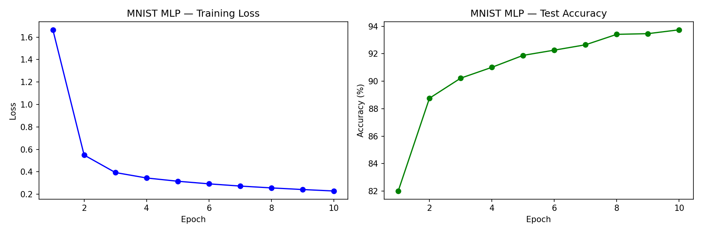
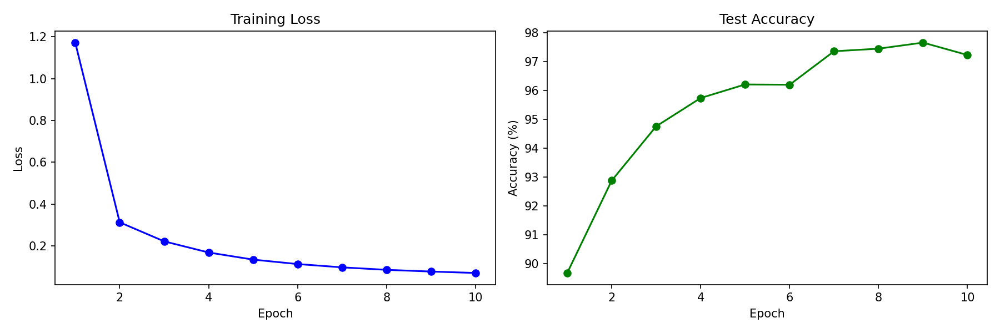
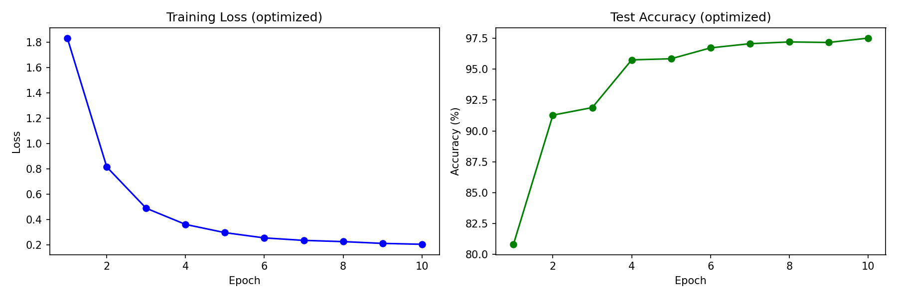
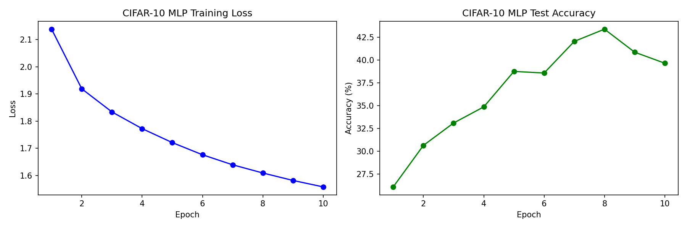
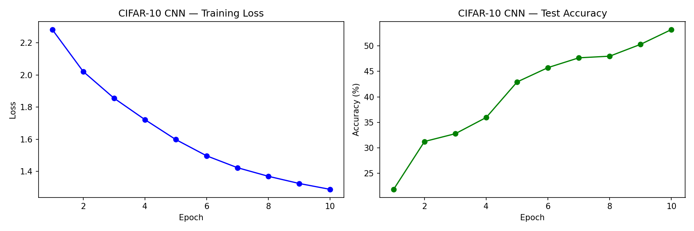
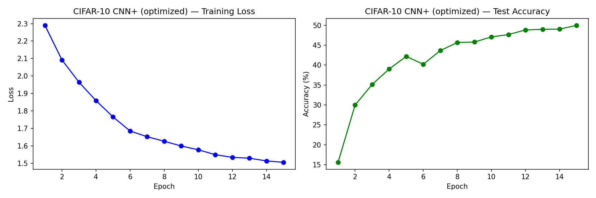
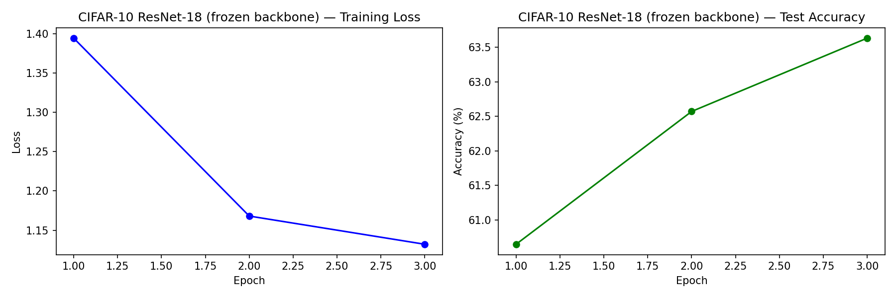
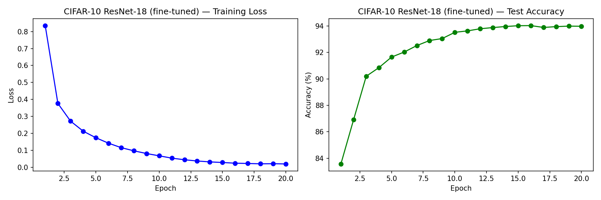

# PyTorch CNN 图像分类项目

第三阶段学习项目，在 MNIST 和 CIFAR-10 上对比 MLP、CNN、优化版 CNN。

## 项目结构

```
├── data/              # 数据集（MNIST + CIFAR-10）
├── src/
│   ├── utils.py               # 公共函数（训练/评估/画图/保存/设备探测）
│   ├── mnist/
│   │   ├── explore.py          # 查看 MNIST 数据格式
│   │   ├── mlp.py              # 多层感知机
│   │   ├── cnn.py              # 卷积神经网络
│   │   └── cnn_optimized.py    # CNN + 数据增强/Dropout/学习率调度
│   └── cifar10/
│       ├── mlp.py
│       ├── cnn.py
│       └── cnn_optimized.py
├── images/            # 训练曲线图
├── models/            # 保存的模型 .pth 文件
├── README.md
└── requirements.txt
```

## 运行方法

```bash
pip install -r requirements.txt

# MNIST
python src/mnist/mlp.py
python src/mnist/cnn.py
python src/mnist/cnn_optimized.py

# CIFAR-10
python src/cifar10/mlp.py
python src/cifar10/cnn.py
python src/cifar10/cnn_optimized.py
```

## 实验结果

| | MLP | CNN | CNN + 数据增强 |
|---|---|---|---|
| MNIST | 93.74% | 97.90% | 97.26% |
| CIFAR-10 | 51.94% | 76.88% | 80.03% |

> CIFAR-10 使用 5 层卷积 + BatchNorm + momentum SGD，统一训练 50 epoch。
> MNIST 使用 2 层卷积 + 10 epoch。

**CNN（无增强）vs CNN+数据增强**：前者训练 loss 0.07 但测试 76.88%，后者训练 loss 0.60 但测试 80.03%。
数据增强让模型更难"背答案"，训练集上表现变差，但测试集泛化更好——这正是防过拟合手段应该起到的效果。

**MLP vs CNN**：CIFAR-10 上 CNN 比 MLP 高出 25 个百分点。纯全连接看不到像素间的空间关系，在真实图片上天然吃亏。

- 所有结果已用 `set_seed(42)` 固定随机种子，可复现
- 优化器统一使用 SGD + momentum=0.9 + StepLR

## 训练曲线

**MNIST（10 epoch）**

| MLP | CNN | CNN + 防过拟合 |
|---|---|---|
|  |  |  |

**CIFAR-10（50 epoch）**

| MLP | CNN | CNN + 数据增强 |
|---|---|---|
|  |  |  |

**迁移学习（预训练 ResNet-18，为 32×32 改造 stem）**

| 冻结 backbone（只训分类头） | 全量微调 |
|---|---|
|  |  |

> ⚠️ 这一组**不是"哪个更强"的公平对比** —— 训练预算不同：冻结版只训 3 epoch，全量微调训 20 epoch。
> 冻结版的作用是**诊断**：验证预训练权重到底有没有被装上。ResNet-18 的 stem 要从 7×7 stride 2 改成
> 3×3 stride 1 才能吃 32×32 的图，如果直接 `nn.Conv2d(...)` 新建一层，那是**随机初始化**，
> 而 backbone 又被冻结，这层就永远学不回来 —— 准确率掉到 46.99%，比从头训还差。
> 正确做法是用 `F.interpolate` 把预训练权重插值搬过去，改完立刻回到 63.63%。
> 这条诊断链比准确率本身更能说明"预训练有没有生效"。

> 每个模型都是 loss + 准确率双图。两条曲线的差距就是判断欠拟合 / 过拟合的依据。

## 技术栈

Python 3 / PyTorch / torchvision / matplotlib / numpy
