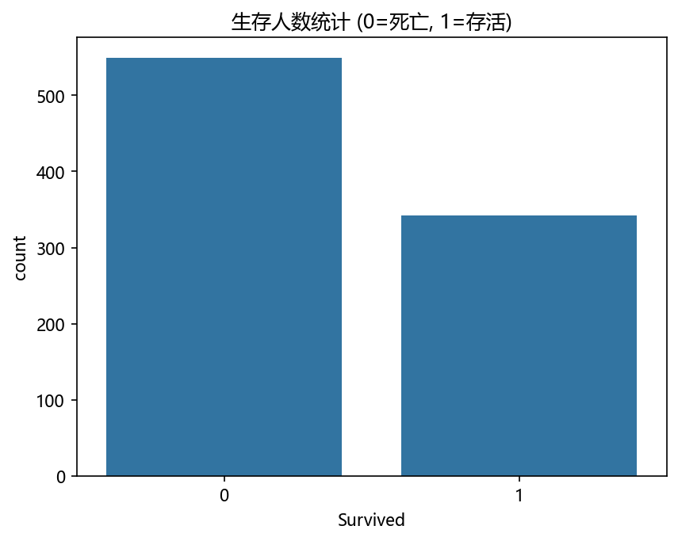
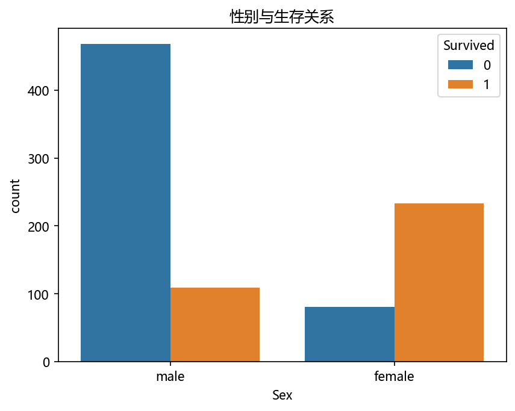
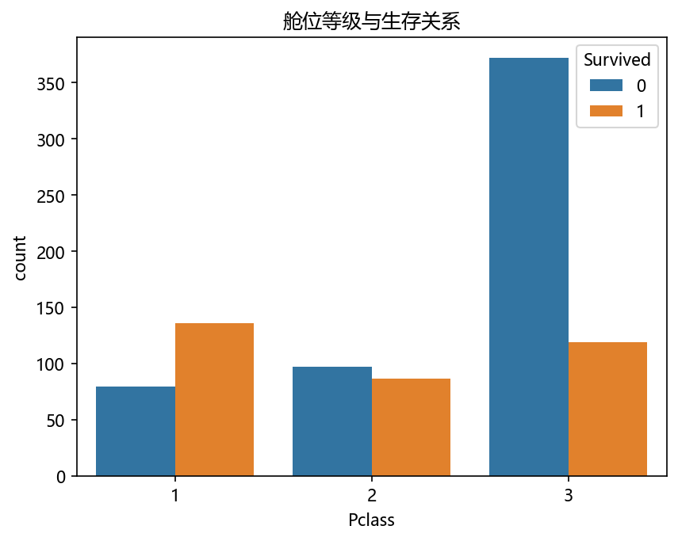
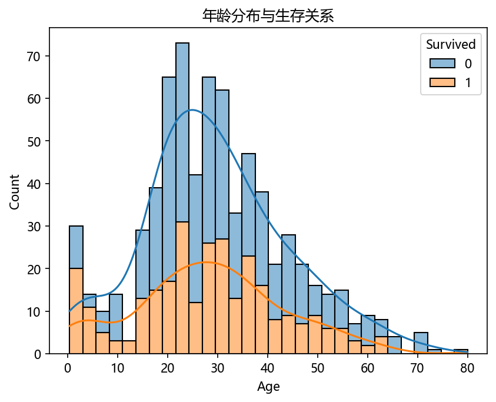
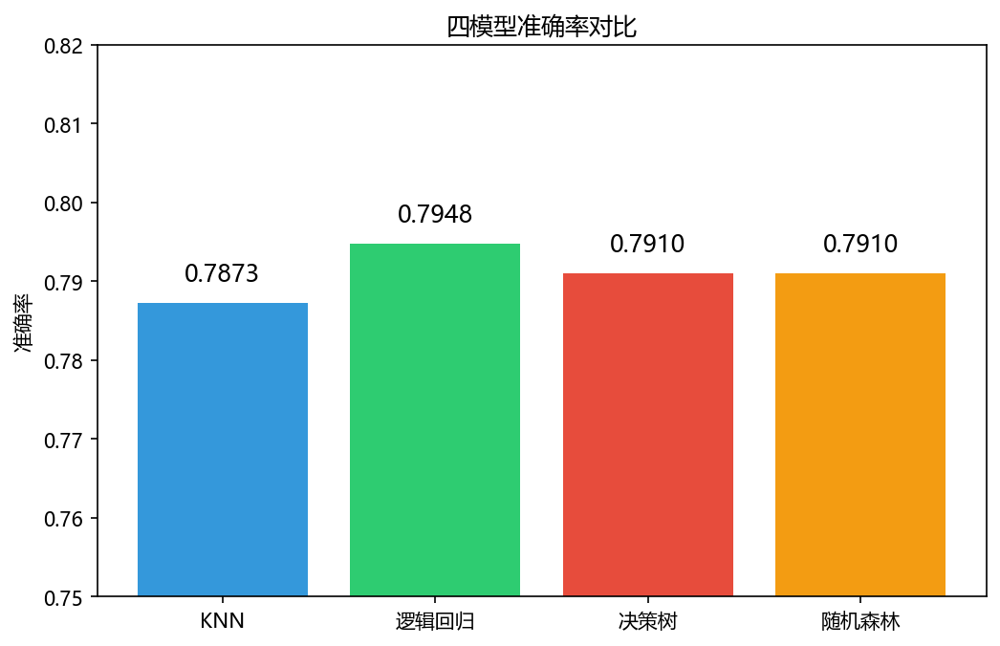
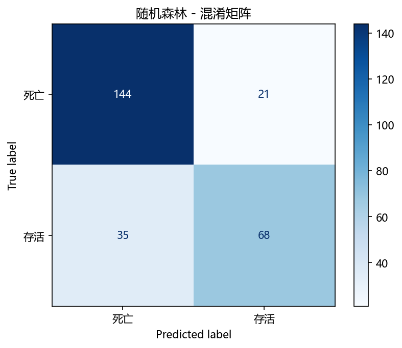
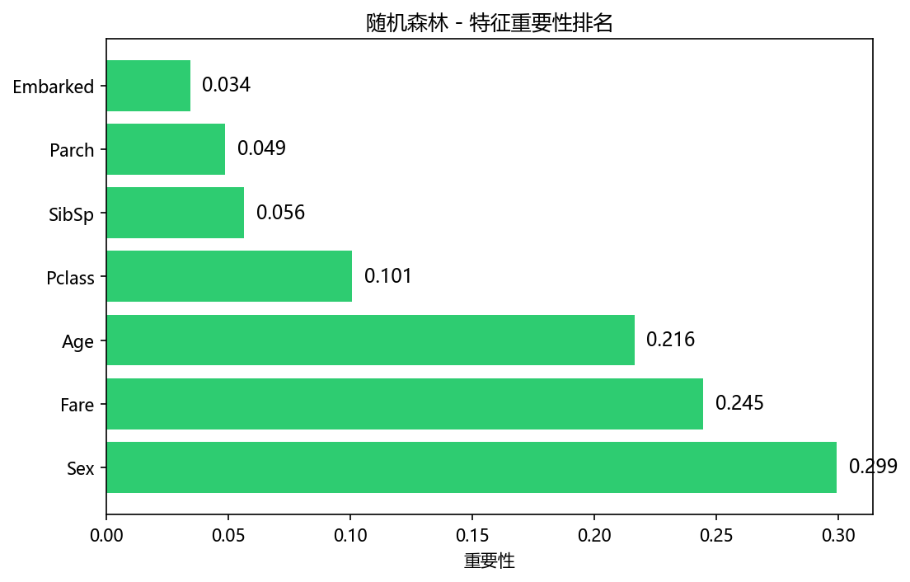

# 泰坦尼克号生存预测

基于 scikit-learn 的传统机器学习分类项目，对比四种模型预测泰坦尼克号乘客存活情况。

## 项目结构

```
titanic_project/
├── data/train.csv          # 原始数据（891行×12列）
├── src/
│   ├── titanic_common.py        # 两个排查脚本共用的数据与工具（同一份切分/预处理）
│   ├── explore.py               # 数据探索与可视化
│   ├── preprocess.py            # 数据预处理
│   ├── train.py                 # 模型训练、对比、调参、评估
│   ├── check_saturation.py      # 【排查之一】模型侧饱和了吗（四项检查）
│   └── explore_routes.py        # 【排查之二】候选路线往哪走（四条路线）
├── images/                 # 所有输出图表（7张）
├── models/                 # 调参后的随机森林模型
├── requirements.txt
├── README.md

```

### 两个排查脚本的关系（顺序不能反）

```text
check_saturation.py  ──→  explore_routes.py
模型侧还调得动吗？            换方向：往哪加信息？
├ ① 收敛 / ② 容量            ├ 调阈值（不产生新信息）
├ ③ 规模 / ④ 超参            ├ 类别加权（提召回掉精确率）
└ 四项全排除 → 饱和            └ 加「称谓」← 唯一有效的
```

**先证明"调参这条路走死了"，才有资格说"要加特征"。** 顺序反了就是拍脑袋。

> 这两个脚本**共用 `titanic_common.py` 的数据准备**，保证两边的"基线"是同一个数
> （同一个随机森林基线 0.7910）。早期版本把两件事塞在一个脚本里，导致
> "规模/超参"的 0.8022 和"候选路线"的 0.7985 口径混淆，说不清差在哪。

## 运行方法

```bash
# 安装依赖（只需一次）
pip install -r requirements.txt
```

项目使用 `os.path` 定位数据和图片目录，无需刻意切换工作目录。以下任一方式均可：

```bash
# 方式一：从项目根目录运行
python src/explore.py
python src/preprocess.py
python src/train.py
python src/check_saturation.py   # 排查之一：四项检查（含网格搜索，约 1 分钟）
python src/explore_routes.py     # 排查之二：四条候选路线

# 方式二：进入 src 目录运行
cd src
python explore.py
python preprocess.py
python train.py
python check_saturation.py
python explore_routes.py

# 方式三：从任意目录直接用绝对路径运行
python /path/to/titanic_project/src/explore.py
```

## 方法

- 数据预处理：删无用列 → 中位数填充 → 类别编码 → 标准化
- 模型对比：KNN / 逻辑回归 / 决策树 / 随机森林
- 调参：GridSearchCV（5折交叉验证）
- 评估指标：准确率、精确率、召回率、F1、混淆矩阵

## 结果

| 模型 | 准确率 | 存活精确率 | 存活召回率 | 存活 F1 |
|------|--------|-----------|-----------|---------|
| KNN | 0.787 | 0.74 | 0.68 | 0.71 |
| 逻辑回归 | 0.795 | 0.74 | 0.71 | 0.73 |
| 决策树 | 0.791 | 0.81 | 0.60 | 0.69 |
| 随机森林（默认） | 0.791 | 0.76 | 0.66 | 0.71 |
| 随机森林（调参后） | 0.802 | 0.79 | 0.66 | 0.72 |

### 图表产出

**数据探索（`src/explore.py`）**

| 生存人数统计 | 性别与生存关系 |
|---|---|
|  |  |

| 舱位等级与生存关系 | 年龄分布与生存关系 |
|---|---|
|  |  |

**模型评估（`src/train.py`）**

| 四模型准确率对比 | 随机森林混淆矩阵 |
|---|---|
|  |  |

| 随机森林特征重要性 |
|---|
|  |

> 注：四模型对比图把 y 轴缩到 0.75~0.82，是为了看清这 1% 的差距；四个模型的实际差距很小 —— 这也正是下面结论的出发点。

## 结论

### 1. 模型侧已经饱和 —— 不是训练不足，也不是参数没调到

四个模型（KNN / 逻辑回归 / 决策树 / 随机森林）在默认配置下，存活召回全落在 0.60~0.71。
做了四组**独立**排查，把「收敛 → 容量 → 规模 → 超参」逐个排除：

| 排查项 | 做法 | 结果 |
|---|---|---|
| 1. 收敛 | 逻辑回归的 `n_iter_` 与 `max_iter` | **8 次迭代即收敛**；`max_iter` 从 100 加到 10 万，结果一字不变 |
| 2. 容量 | 决策树扫 `max_depth` 2 → 5 → 10 → 20 → None | **越深越差**：depth=5 时 0.791，不限深度跌到 0.761；同时训练集冲到 **0.979** —— 已在过拟合一侧，容量过剩 |
| 3. 规模 | 随机森林扫 `n_estimators` 10 → 1000 | 100 → 1000 只 **+0.011**（多答对 3 题），而且**不单调**（200 和 500 一样）—— 收益趋零，属噪声级抖动 |
| 4. 超参 | GridSearchCV 36 组 × 5 折 = 180 次训练 | 0.791 → 0.802（**+1.1%**，也是多答对 3 题），召回始终 0.66 |

⚠️ 3 和 4 都是「+3 题 = 215/268」：
说明网格搜索最优组合是「200 棵树 + 深度 10」结果0.8022，
而单看 200 棵树只有 0.7948、单看 1000 棵树也是 0.8022 —— 结果相同且**互不叠加**。

换算成「答对几题」，噪声带就一目了然 —— **拧旋钮的方式全挤在 212~215 这 4 题宽里**：
基线 212 → 调阈值 213 → 类别加权 214 → 堆到 1000 棵 215 → 网格搜索 215 → 加家庭规模 215；
**加「称谓」一步跳到 220（森林）/ 224（逻辑回归）** —— 唯一跳出噪声带的手段。

**加大 epoch、加深模型、继续调参，都不会改变结果。**

### 2. 三条路各实测一遍（测试集全程不参与调参）

数据 62% 死亡 / 38% 存活，模型输出的概率天然偏向多数类。三条候选路线分别实测：

| 手段 | 准确率 | 存活精确率 | 存活召回率 | 存活 F1 | 性质 |
|---|---|---|---|---|---|
| 逻辑回归 · 默认阈值 0.50 | 0.795 | 0.74 | 0.71 | 0.73 | 基线 |
| 逻辑回归 · 验证集上选阈值（0.30）| 0.776 | 0.67 | **0.83** | 0.74 | 曲线内滑动（准确率反降 1.9 个点）|
| 逻辑回归 · `class_weight='balanced'` | 0.799 | 0.71 | **0.81** | 0.75 | 曲线内滑动 |
| 逻辑回归 · + 称谓（one-hot）| **0.836** | 0.80 | 0.77 | **0.78** | **曲线外推（提升最大）** |
| 随机森林 · 默认阈值 0.50 | 0.791 | 0.76 | 0.66 | 0.71 | 基线 |
| 随机森林 · 验证集上选阈值（0.48）| 0.795 | 0.76 | 0.68 | 0.72 | 曲线内滑动 |
| 随机森林 · `class_weight='balanced'` | 0.799 | 0.76 | 0.70 | 0.73 | 曲线内滑动 |
| **随机森林 · + 称谓（one-hot）** | **0.821** | **0.83** | 0.67 | **0.74** | **曲线外推** |

**三条路线的性质完全不同**：

- **调阈值：不产生新信息。** 它只是换一个切点，把「漏判」和「误判」互换 —— 逻辑回归阈值降到 0.30，召回 0.71 → 0.83，但精确率 0.74 → 0.67，F1 只从 0.73 挪到 0.74；随机森林召回 +2 个点，准确率只 +0.4 个点
- **类别加权：能提召回，但代价是精确率**（0.74 → 0.71）—— 它只是在**同一条 PR 曲线上滑动**，不增加模型可用的信息
- **加特征：把整条 PR 曲线往外推** —— 随机森林 0.791 → 0.821、精确率 0.76 → 0.83；逻辑回归 0.795 → 0.836。准确率和精确率同时上升，召回也没掉

### 3. 下一步（按实测收益排序）

1. **加特征** —— 从 `Name` 提取称谓（Mr / Mrs / Miss / Master）并做 **one-hot 编码**
2. **类别加权** —— 只在"必须把召回提上去"时用，接受精确率下降
3. ~~调参~~ / ~~调阈值~~ —— 已实测无用

### 4. 元教训：排查顺序

一开始把「召回低」归因给「特征不够」，是跳过了前面的排查步骤。正确的顺序是：

```
① 优化收敛了吗    → n_iter_ / loss 曲线
② 模型容量够吗    → 深度 / 树数 / 层数 / epoch   ← 容量和规模是同一个问题的两个旋钮
③ 超参数到顶了吗  → 网格搜索
④ 评估口径对吗    → 决策阈值 / 指标选择 / 类别不均衡   ← 对应上面「三条路各实测一遍」那张表
⑤ 以上都排除了    → 才轮到「特征 / 信息量」
```
